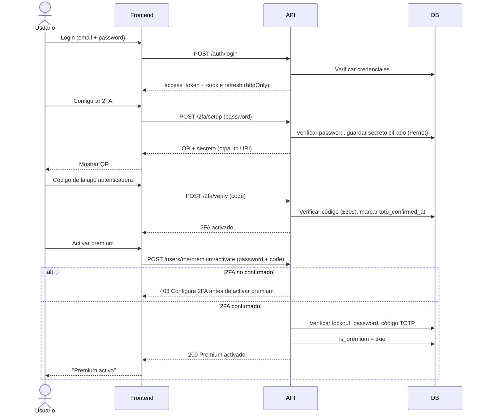

# CIDI — Rate Limiter, Autenticador y "Spotify" API

[](https://github.com/davidmorgadocarames/cidi_ratelimiter_autenticator_spotify/actions/workflows/ci.yml)

Repositorio: https://github.com/davidmorgadocarames/cidi_ratelimiter_autenticator_spotify

Proyecto de portfolio que combina, sobre una API tipo Spotify con datos reales:

- **CI/CD real** con GitHub Actions (tests, lint, type-check, despliegue a staging/producción).
- **Rate limiting con Redis** usando el algoritmo *token bucket*.
- **Autenticación de dos factores (TOTP, RFC 6238)** para proteger acciones sensibles.
- **API de streaming de audio**: subida y transcodificación, streaming con Range Requests,
  búsqueda, recomendaciones precalculadas, caché de contenido popular y sincronización entre
  dispositivos.

El objetivo es demostrar decisiones de arquitectura de backend a nivel de producción (no solo
"que funcione"), documentando explícitamente qué está implementado de verdad y qué queda como
diseño teórico razonado.

## Estado actual

🚧 **Fases 0-5 completadas** — scaffolding del proyecto, API base con autenticación JWT
(registro, login, refresh con rotación y detección de reuso, logout, endpoint `/auth/me`) contra
Postgres real, una UI mínima integrada (registro, login, dashboard) servida por la propia API,
autenticación de dos factores (TOTP, RFC 6238) protegiendo la activación de premium, tooling de
calidad de código local (mypy en modo `--strict`, ruff, black, cobertura, pre-commit), y CI real
en GitHub Actions (tests + lint + type-check en cada PR, matriz de Python 3.10/3.11/3.12). Ver el
roadmap completo abajo y el detalle de qué está implementado vs pendiente en
[`docs/architecture.md`](docs/architecture.md).

## Frontend: UI integrada vs frontend separado

Para la Fase 2 se evaluó levantar un frontend separado (ej. Vite + JS/React con su propio dev
server) frente a servir una UI mínima directamente desde FastAPI. Se eligió la **UI integrada**:
HTML/CSS/JS vanilla en [`app/static/`](app/static/), servido como estáticos por la propia API
(`StaticFiles` montado en `/`), mismo origen — sin CORS, sin build tooling, sin dependencias de
frontend. Motivo: este es un proyecto de portfolio **backend-focused** (CI/CD, rate limiter,
TOTP, streaming); un frontend separado añadiría complejidad (configuración de CORS, otro conjunto
de dependencias, un proceso de build) sin aportar a lo que el proyecto quiere demostrar. La UI
solo necesita ser suficiente para probar el login, el registro y el toggle de premium de verdad
desde un navegador, no ser vistosa.

Uso: con la API corriendo, abre `http://localhost:8000/` — permite registrarte o iniciar sesión,
configurar 2FA (QR + confirmación) y, desde el dashboard, ver tu email, tu estado de premium y
activarlo/desactivarlo. Activar premium llama de verdad a
`POST /users/me/premium/activate` con contraseña + código TOTP (ver sección "Flujo de 2FA" abajo)
— no es un cambio solo visual; desactivar sigue siendo `POST /users/me/premium/deactivate`, sin
esa fricción extra. El access token vive únicamente en una variable JS en memoria (no en
`localStorage`, ver [`docs/architecture.md`](docs/architecture.md) para el matiz de qué protege
esto y qué no) — se pierde al recargar la página, pero un "silent refresh"
(`POST /auth/refresh` vía la cookie `httpOnly`) recupera la sesión automáticamente sin pedir
credenciales de nuevo.

## Flujo de 2FA y activación de premium

El código de 6 dígitos se calcula con [pyotp](https://github.com/pyauth/pyotp) (RFC 6238: HMAC-SHA1
sobre un contador de pasos de 30s, truncado dinámicamente a 6 dígitos), con una ventana de
tolerancia de ±1 paso (±30s) por posible desfase de reloj entre servidor y dispositivo. El secreto
se guarda cifrado en Postgres (Fernet) y nunca se vuelve a mostrar en claro tras el setup inicial.



## Stack técnico (previsto)

- **Backend**: Python 3 + FastAPI
- **Base de datos**: PostgreSQL (SQLAlchemy 2.0)
- **Cache / Rate limiting**: Redis
- **Búsqueda**: Meilisearch
- **Cola de tareas en background**: Celery + Redis
- **Almacenamiento de objetos**: MinIO (compatible S3)
- **Contenedores**: Docker / docker-compose
- **CI/CD**: GitHub Actions

## Roadmap

| Fase | Contenido |
| ---- | --------- |
| 0 | Scaffolding del proyecto |
| 1 | API base y autenticación (JWT) |
| 2 | UI de login y registro, toggle de premium |
| 3 | Autenticación de dos factores (TOTP) |
| 4 | Calidad de código local (pytest-cov, ruff, black, mypy, pre-commit) |
| 5 | CI (GitHub Actions, matriz de Python) |
| 6 | Rate limiter con Redis (token bucket) |
| 7 | Contenedores (Docker, docker-compose, healthchecks) |
| 8 | Subida y transcodificación de audio (ffmpeg, MinIO) |
| 9 | Streaming de audio (Range Requests, control plane vs data plane) |
| 10 | Búsqueda (Meilisearch) |
| 11 | Recomendaciones precalculadas (Celery) |
| 12 | Caché de contenido popular |
| 13 | Sincronización entre dispositivos |
| 14 | CD (staging/producción, rollback) |
| 15 | Documentación final para portfolio |

## Desarrollo local

Requiere Python 3.13 en local (única versión instalada en esta máquina). El CI (Fase 5) corre
además la suite completa contra 3.10/3.11/3.12 en GitHub Actions — verificado en verde en las
tres, ver [`docs/architecture.md`](docs/architecture.md#riesgos-conocidos). Requiere también
Docker (para Postgres, adelantado a la Fase 1).

```bash
python -m venv .venv
# Windows (PowerShell)
.venv\Scripts\Activate.ps1
# Linux/Mac
source .venv/bin/activate

# Para desarrollo (ya incluye requirements.txt vía -r; añade pytest, httpx, pytest-cov,
# ruff, black, mypy, pre-commit):
pip install -r requirements-dev.txt
# Si solo necesitas runtime (ej. lo que instalaría la imagen Docker de producción,
# Fase 7), sin nada de lo anterior:
pip install -r requirements.txt
```

Copia `.env.example` a `.env` y completa los valores. Desde la Fase 1 son obligatorias:
`DATABASE_URL`, `TEST_DATABASE_URL`, `JWT_SECRET_KEY` (la app rechaza arrancar con el valor
placeholder `change-me` — genera uno real con `openssl rand -hex 32`) y `COOKIE_SECURE` (`false`
en desarrollo local sin HTTPS). El resto de variables se van sumando fase a fase.

Levantar Postgres y aplicar las migraciones antes de correr la API o los tests:

```bash
docker compose up -d postgres
alembic upgrade head
uvicorn app.main:app --reload
# en otra terminal
pytest tests/ -v
```

Los tests corren contra una base de datos Postgres real y separada (`spotify_clone_test`, creada
automáticamente por `docker/postgres-init/`), no contra SQLite ni con mocks.

## Calidad de código local

Con `requirements-dev.txt` instalado:

```bash
ruff check .                              # linter
black .                                   # formateador
mypy app tests                            # chequeo de tipos (--strict)
pytest tests/ --cov=app --cov-report=term-missing   # tests + cobertura
```

`pre-commit install` (una vez) activa un hook de git que corre automáticamente `ruff`, `black`,
`mypy` y unos hooks de higiene básicos (espacios en blanco, fin de archivo, YAML válido) antes de
cada commit. **pytest no está en este hook a propósito**: necesita Postgres corriendo en Docker,
así que se deja para CI (Fase 5) y para correrlo manualmente. El hook de `mypy` es local
(`language: system`, no el mirror oficial de pre-commit) porque resolver los tipos de
FastAPI/SQLAlchemy/Pydantic correctamente requiere el entorno del proyecto instalado — esto
significa que usa el `mypy` que encuentre en el `PATH` de quien commitea: **el venv debe estar
activado** en la terminal donde se hace `git commit`, o el hook falla con
`Executable 'mypy' not found`.

## CI (GitHub Actions)

`.github/workflows/ci.yml` corre en cada Pull Request contra `main` (y en cada push a `main`,
como red de seguridad post-merge): las mismas herramientas de la sección anterior
(`ruff check`, `black --check`, `mypy app tests`, `pytest --cov=app --cov-fail-under=85`) más
`alembic upgrade head` contra un Postgres real levantado como servicio del propio job — ahora
obligatorias en cada PR, no solo un hook local. Matriz de Python `3.10`, `3.11`, `3.12` (el mínimo
soportado según se documentó desde la Fase 0, no la 3.13 del entorno local).

**Setup necesario en GitHub antes del primer run** (una sola vez):

1. **Secrets** — Settings → Secrets and variables → Actions → New repository secret. El workflow
   necesita `JWT_SECRET_KEY`/`TOTP_ENCRYPTION_KEY` válidos (la app rechaza arrancar con el
   placeholder `change-me`), pero son valores **efímeros de CI, no credenciales reales** — nunca
   hardcodeados en el YAML por higiene (ver `docs/architecture.md`), sino como Secrets:
   - `CI_JWT_SECRET_KEY`
   - `CI_TOTP_ENCRYPTION_KEY`
2. **Branch protection** — Settings → Branches → Add branch protection rule → branch name
   pattern `main` → marcar "Require status checks to pass before merging" → seleccionar los 3
   checks de la matriz (`test (3.10)`, `test (3.11)`, `test (3.12)`) una vez hayan corrido al
   menos una vez (aparecen en la lista tras el primer PR). Esto bloquea el merge si el CI falla.

## Decisiones de diseño

Documentadas progresivamente en [`docs/architecture.md`](docs/architecture.md) a medida que se
toman (por qué Redis, por qué token bucket, por qué TOTP, por qué Postgres, etc.).

## Licencia y autoría

MIT License. Proyecto personal de portfolio desarrollado por [davidmorgadocarames](https://github.com/davidmorgadocarames).
