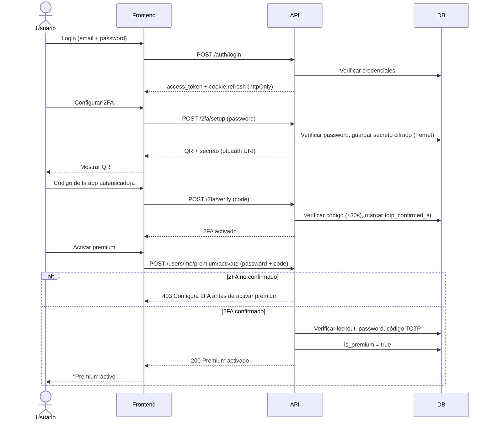

# CIDI — Rate Limiter, Autenticador y "Spotify" API

Repositorio: https://github.com/davidmorgadocarames/cidi_ratelimiter_autenticator_spotify

Proyecto de portfolio que combina, sobre una API tipo Spotify con datos reales:

- **CI/CD real** con GitHub Actions (tests, lint, type-check, despliegue a staging/producción).
- **Rate limiting con Redis** usando el algoritmo *token bucket*.
- **Autenticación de dos factores (TOTP, RFC 6238)** para proteger acciones sensibles.
- **API de streaming de audio**: subida y transcodificación, streaming con Range Requests,
  búsqueda, recomendaciones precalculadas, caché de contenido popular y sincronización entre
  dispositivos.

El objetivo es demostrar decisiones de arquitectura de backend a nivel de producción (no solo
"que funcione"), documentando explícitamente qué está implementado de verdad y qué queda como
diseño teórico razonado.

## Estado actual

🚧 **Fases 0-3 completadas** — scaffolding del proyecto, API base con autenticación JWT
(registro, login, refresh con rotación y detección de reuso, logout, endpoint `/auth/me`) contra
Postgres real, una UI mínima integrada (registro, login, dashboard) servida por la propia API, y
autenticación de dos factores (TOTP, RFC 6238) protegiendo la activación de premium. Ver el
roadmap completo abajo y el detalle de qué está implementado vs pendiente en
[`docs/architecture.md`](docs/architecture.md).

## Frontend: UI integrada vs frontend separado

Para la Fase 2 se evaluó levantar un frontend separado (ej. Vite + JS/React con su propio dev
server) frente a servir una UI mínima directamente desde FastAPI. Se eligió la **UI integrada**:
HTML/CSS/JS vanilla en [`app/static/`](app/static/), servido como estáticos por la propia API
(`StaticFiles` montado en `/`), mismo origen — sin CORS, sin build tooling, sin dependencias de
frontend. Motivo: este es un proyecto de portfolio **backend-focused** (CI/CD, rate limiter,
TOTP, streaming); un frontend separado añadiría complejidad (configuración de CORS, otro conjunto
de dependencias, un proceso de build) sin aportar a lo que el proyecto quiere demostrar. La UI
solo necesita ser suficiente para probar el login, el registro y el toggle de premium de verdad
desde un navegador, no ser vistosa.

Uso: con la API corriendo, abre `http://localhost:8000/` — permite registrarte o iniciar sesión,
configurar 2FA (QR + confirmación) y, desde el dashboard, ver tu email, tu estado de premium y
activarlo/desactivarlo. Activar premium llama de verdad a
`POST /users/me/premium/activate` con contraseña + código TOTP (ver sección "Flujo de 2FA" abajo)
— no es un cambio solo visual; desactivar sigue siendo `POST /users/me/premium/deactivate`, sin
esa fricción extra. El access token vive únicamente en una variable JS en memoria (no en
`localStorage`, ver [`docs/architecture.md`](docs/architecture.md) para el matiz de qué protege
esto y qué no) — se pierde al recargar la página, pero un "silent refresh"
(`POST /auth/refresh` vía la cookie `httpOnly`) recupera la sesión automáticamente sin pedir
credenciales de nuevo.

## Flujo de 2FA y activación de premium

El código de 6 dígitos se calcula con [pyotp](https://github.com/pyauth/pyotp) (RFC 6238: HMAC-SHA1
sobre un contador de pasos de 30s, truncado dinámicamente a 6 dígitos), con una ventana de
tolerancia de ±1 paso (±30s) por posible desfase de reloj entre servidor y dispositivo. El secreto
se guarda cifrado en Postgres (Fernet) y nunca se vuelve a mostrar en claro tras el setup inicial.



## Stack técnico (previsto)

- **Backend**: Python 3 + FastAPI
- **Base de datos**: PostgreSQL (SQLAlchemy 2.0)
- **Cache / Rate limiting**: Redis
- **Búsqueda**: Meilisearch
- **Cola de tareas en background**: Celery + Redis
- **Almacenamiento de objetos**: MinIO (compatible S3)
- **Contenedores**: Docker / docker-compose
- **CI/CD**: GitHub Actions

## Roadmap

| Fase | Contenido |
| ---- | --------- |
| 0 | Scaffolding del proyecto |
| 1 | API base y autenticación (JWT) |
| 2 | UI de login y registro, toggle de premium |
| 3 | Autenticación de dos factores (TOTP) |
| 4 | Calidad de código local (pytest-cov, ruff, black, mypy, pre-commit) |
| 5 | CI (GitHub Actions, matriz de Python) |
| 6 | Rate limiter con Redis (token bucket) |
| 7 | Contenedores (Docker, docker-compose, healthchecks) |
| 8 | Subida y transcodificación de audio (ffmpeg, MinIO) |
| 9 | Streaming de audio (Range Requests, control plane vs data plane) |
| 10 | Búsqueda (Meilisearch) |
| 11 | Recomendaciones precalculadas (Celery) |
| 12 | Caché de contenido popular |
| 13 | Sincronización entre dispositivos |
| 14 | CD (staging/producción, rollback) |
| 15 | Documentación final para portfolio |

## Desarrollo local

Requiere Python 3.13 (única versión verificada en este entorno; la CI de la Fase 5 se ejecutará
además sobre 3.10/3.11/3.12 — ver [`docs/architecture.md`](docs/architecture.md#riesgos-conocidos)
para el riesgo de desalineación de versiones) y Docker (para Postgres, adelantado a la Fase 1).

```bash
python -m venv .venv
# Windows (PowerShell)
.venv\Scripts\Activate.ps1
# Linux/Mac
source .venv/bin/activate

pip install -r requirements.txt
```

Copia `.env.example` a `.env` y completa los valores. Desde la Fase 1 son obligatorias:
`DATABASE_URL`, `TEST_DATABASE_URL`, `JWT_SECRET_KEY` (la app rechaza arrancar con el valor
placeholder `change-me` — genera uno real con `openssl rand -hex 32`) y `COOKIE_SECURE` (`false`
en desarrollo local sin HTTPS). El resto de variables se van sumando fase a fase.

Levantar Postgres y aplicar las migraciones antes de correr la API o los tests:

```bash
docker compose up -d postgres
alembic upgrade head
uvicorn app.main:app --reload
# en otra terminal
pytest tests/ -v
```

Los tests corren contra una base de datos Postgres real y separada (`spotify_clone_test`, creada
automáticamente por `docker/postgres-init/`), no contra SQLite ni con mocks.

## Decisiones de diseño

Documentadas progresivamente en [`docs/architecture.md`](docs/architecture.md) a medida que se
toman (por qué Redis, por qué token bucket, por qué TOTP, por qué Postgres, etc.).

## Licencia y autoría

MIT License. Proyecto personal de portfolio desarrollado por [davidmorgadocarames](https://github.com/davidmorgadocarames).
